# Growse MVP 要件定義書

## 1. 文書概要

### 1.1 プロダクト名

**Growse**

### 1.2 プロダクト定義

Growseは、JavaScriptではなく**GoをWebページのクライアントサイドプログラミング言語として実行する独自Webブラウザ**である。

従来のWebアプリケーションが、

```text
HTML
CSS
JavaScript
```

で構成されるのに対し、Growseでは、

```text
HTML
CSS
Go
```

によってWebアプリケーションを構成する。

GrowseはJavaScriptエンジンを搭載しない。

また、GoコードをWebAssemblyへコンパイルして実行する方式も採用しない。

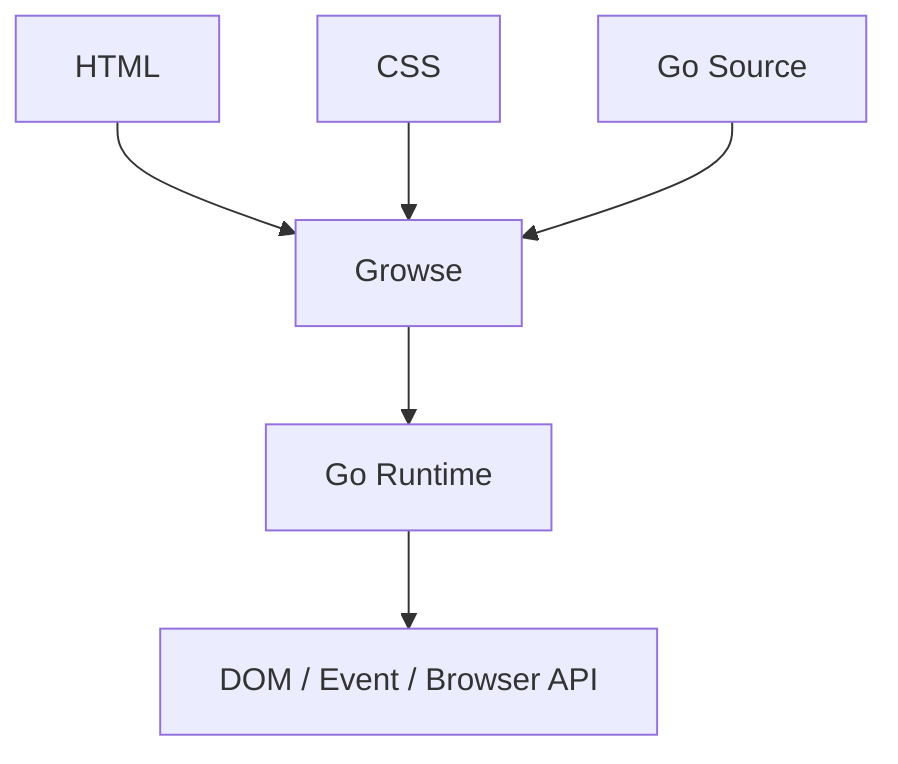

という独自のWeb実行環境を提供する。

---

# 2. プロダクトコンセプト

Growseのコンセプトを以下とする。

> **A browser where Go replaces JavaScript.**

Growseの目的は「GoでブラウザのGUIを作ること」ではない。

最も重要な特徴は、

> **WebページからGoソースコードを取得し、そのGoコードによってWebページを動作させること**

である。

そのため、以下の構成をGrowseの基本モデルとする。

```text
HTML = Structure
CSS  = Presentation
Go   = Behavior
```

---

# 3. MVPの目的

MVPではChromeやFirefoxと同等のブラウザを構築することを目的としない。

以下の技術的成立性を証明する。

1. Growse自身がHTMLを解析できる
2. Growse自身がCSSを解釈できる
3. Growse自身がWebページをレイアウト・描画できる
4. `<script type="text/go">` を認識できる
5. WebページからGoソースコードを取得できる
6. GoソースコードをGrowse内部で実行できる
7. GoコードからDOMを操作できる
8. Goコードからイベントを処理できる
9. JavaScriptを一切使用せず動的Webページを構築できる

---

# 4. MVP完成イメージ

以下のWebページが動作することを最終的なMVP完成条件とする。

## 4.1 HTML

```html
<!doctype html>

<html>
<head>
    <title>Growse Counter</title>
    <link rel="stylesheet" href="/style.css">
</head>

<body>
    <main class="container">
        <h1>Growse Counter</h1>

        <button id="increment">
            +
        </button>

        <p id="count">
            0
        </p>
    </main>

    <script type="text/go" src="/app.go"></script>
</body>
</html>
```

## 4.2 CSS

```css
.container {
    padding: 32px;
}

h1 {
    font-size: 32px;
}

button {
    width: 80px;
    height: 40px;
}
```

## 4.3 Go

```go
package main

import (
    "growse/dom"
    "growse/strconv"
)

func main() {
    button := dom.GetElementByID("increment")
    output := dom.GetElementByID("count")

    count := 0

    button.OnClick(func() {
        count++
        output.SetText(strconv.Itoa(count))
    })
}
```

### 期待動作

```mermaid
flowchart TD
    URL[URL入力] --> HTMLFetch[index.html取得] --> HTMLParse[HTML解析] --> DOM[DOM生成]
    DOM --> CSSFetch[style.css取得] --> CSSParse[CSS解析] --> Layout --> Render[画面描画]
    Render --> GoFetch[app.go取得] --> Main[Go Runtimeで main() 実行] --> Listener[イベントハンドラ登録]
    Listener --> Click[ユーザーが「+」をクリック] --> Handler[Goイベントハンドラ実行]
    Handler --> Mutation[DOM更新] --> Relayout[再Layout] --> Rerender[再描画]
```

---

# 5. MVP技術スタック

Growse MVPでは以下を採用する。

| 領域            | 技術                                 |
| ------------- | ---------------------------------- |
| 実装言語          | Go                                 |
| GUI / Window  | Gio                                |
| 描画バックエンド      | Gio                                |
| HTTP          | Go標準 `net/http`                    |
| URL処理         | Go標準 `net/url`                     |
| HTML Parser   | `golang.org/x/net/html`            |
| DOM           | Growse独自実装                         |
| CSS構文解析       | `github.com/tdewolff/parse/v2/css` |
| CSS Cascade   | Growse独自実装                         |
| Style Engine  | Growse独自実装                         |
| Layout Engine | Growse独自実装                         |
| Paint Engine  | Growse独自実装                         |
| Go Runtime    | Yaegi                              |
| Browser API   | Growse独自実装                         |

---

# 6. 技術選定方針

## 6.1 Gio

Gioは以下の用途に限定して利用する。

* OSウィンドウ作成
* キーボード入力
* マウス入力
* URLバー
* ブラウザ操作UI
* テキスト描画
* 矩形描画
* 画像描画
* GPUへの描画

GioをHTMLレンダリングエンジンとして使用してはならない。

Webページは、

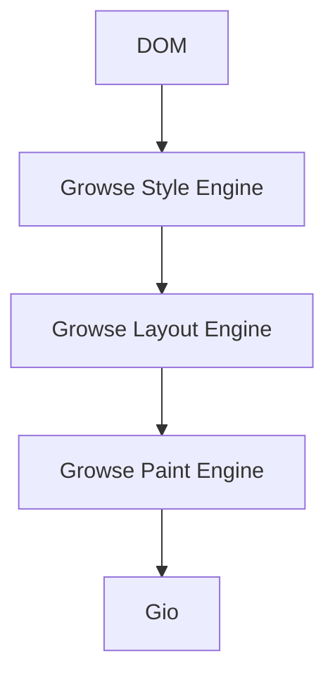

によって描画する。

---

# 7. 外部ブラウザエンジン禁止

Growseでは以下をブラウザエンジンとして利用しない。

* Chromium
* Blink
* WebKit
* WebKitGTK
* Gecko
* CEF
* Electron
* WebView
* Wails WebView

これらを使用してHTMLを表示した場合、Growse独自ブラウザエンジンとはならないため、本プロジェクトの要件を満たさない。

---

# 8. JavaScript要件

## 8.1 JavaScript非対応

GrowseはJavaScriptを実行しない。

以下はすべて実行対象外とする。

```html
<script>
alert("Hello")
</script>
```

```html
<script type="text/javascript">
console.log("Hello")
</script>
```

```html
<script src="/app.js"></script>
```

## 8.2 JavaScript Engine

以下を含むJavaScript Engineを依存関係として搭載しない。

* V8
* SpiderMonkey
* JavaScriptCore
* QuickJS
* Duktape

## 8.3 JavaScript検出時

JavaScriptを検出した場合、MVPでは処理を無視する。

デバッグログには以下を表示する。

```text
Growse: JavaScript is not supported.
```

---

# 9. WebAssembly要件

GoコードをWebAssemblyへ変換して実行してはならない。

禁止する構成：

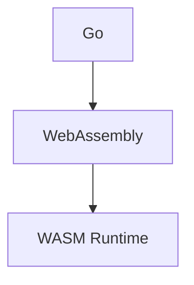

採用する構成：

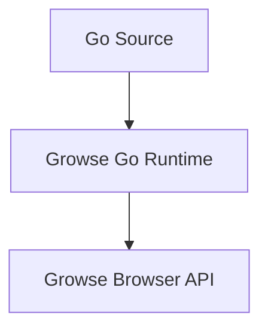

---

# 10. Browser UI

MVPでは以下のUIを実装する。

```text
┌─────────────────────────────────────────────────┐
│ ←   ↻   │ http://localhost:8080            Go │
├─────────────────────────────────────────────────┤
│                                                 │
│                                                 │
│               Growse Viewport                   │
│                                                 │
│                                                 │
└─────────────────────────────────────────────────┘
```

必要機能：

* Backボタン
* Reloadボタン
* URL入力欄
* Goボタン
* Webページ表示領域

---

# 11. Browser Navigation

## 11.1 URLアクセス

ユーザーがURLを指定できる。

例：

```text
http://localhost:8080
https://example.com
```

## 11.2 HTTP

`net/http` を利用してWebリソースを取得する。

対象：

* HTML
* CSS
* Go
* PNG
* JPEG

## 11.3 HTTPS

HTTPSに対応する。

TLSについてはGo標準ライブラリを利用する。

## 11.4 Redirect

以下を処理する。

```text
301
302
307
308
```

## 11.5 Relative URL

以下のような相対URLを解決できる。

```html
<a href="/about">
```

```html
<link rel="stylesheet" href="./style.css">
```

```html
<script type="text/go" src="app.go">
```

---

# 12. Navigation History

最低限以下を実装する。

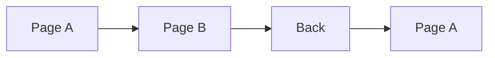

MVPでは、

* Back
* Reload

を必須とする。

Forwardは対象外とする。

---

# 13. HTML Parser

HTML構文解析には、

```text
golang.org/x/net/html
```

を使用する。

処理：

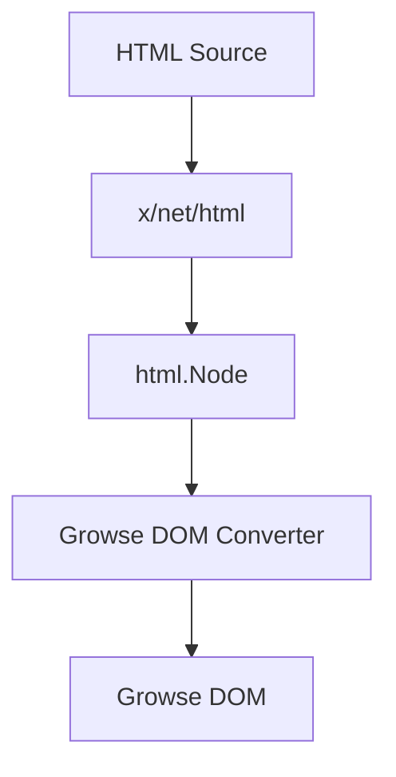

---

# 14. Growse DOM

`x/net/html.Node` をブラウザ内部のDOMとして直接使用しない。

Growse独自DOMへ変換する。

例：

```go
type NodeID uint64

type NodeType int

const (
    DocumentNode NodeType = iota
    ElementNode
    TextNode
)

type Node struct {
    ID NodeID

    Type NodeType

    TagName string
    Text    string

    Attributes map[string]string

    Parent   *Node
    Children []*Node
}
```

---

# 15. DOM要件

DOMは以下を可能とする。

* ノード追加
* ノード削除
* Text Node変更
* Attribute変更
* ID検索
* Selector検索
* Parent取得
* Children取得

---

# 16. HTML対応要素

MVPで最低限以下に対応する。

```text
html
head
title
body

main
div
span

h1
h2
h3

p

a

button

img

style
link
script
```

可能であれば以下も対応する。

```text
input
form
label
```

---

# 17. CSS Parser

CSSのtokenize / parseには、

```text
github.com/tdewolff/parse/v2/css
```

を使用する。

ただしライブラリの役割は**CSS構文解析まで**とする。

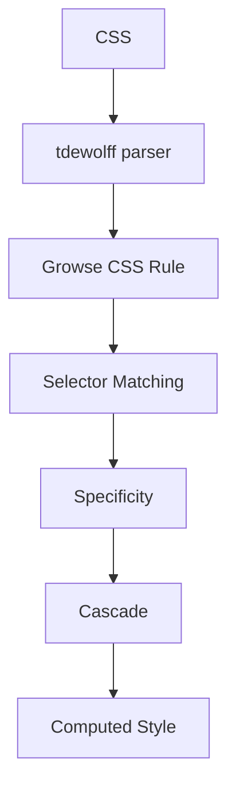

後半はGrowse独自実装とする。

---

# 18. CSS読み込み

以下に対応する。

## 18.1 style要素

```html
<style>
h1 {
    color: red;
}
</style>
```

## 18.2 外部CSS

```html
<link rel="stylesheet" href="/style.css">
```

---

# 19. CSS Selector

MVPでは以下を実装する。

## Tag

```css
p
```

## ID

```css
#counter
```

## Class

```css
.card
```

## Tag + Class

```css
div.card
```

## Descendant

可能であれば以下も対応する。

```css
main p
```

---

# 20. CSS Specificity

最低限、

```text
ID
 >
Class
 >
Tag
```

の優先順位を実装する。

例：

```css
p {
    color: black;
}

.text {
    color: blue;
}

#message {
    color: red;
}
```

対象要素：

```html
<p id="message" class="text">
```

の場合、

```text
red
```

となること。

---

# 21. Computed Style

DOM Nodeごとに計算済みStyleを保持する。

例：

```go
type ComputedStyle struct {
    Display Display

    Color           Color
    BackgroundColor Color

    Width  Length
    Height Length

    Margin  Edges
    Padding Edges
    Border  Border

    FontSize   float32
    FontWeight int
}
```

---

# 22. 対応CSS Property

MVPでは最低限以下を実装する。

## Display

```text
display: block
display: inline
display: none
```

## Color

```text
color
background-color
```

## Size

```text
width
height
```

## Box Model

```text
margin
padding

border-width
border-color
```

## Text

```text
font-size
font-weight
```

---

# 23. Layout Engine

LayoutはGrowse独自実装とする。

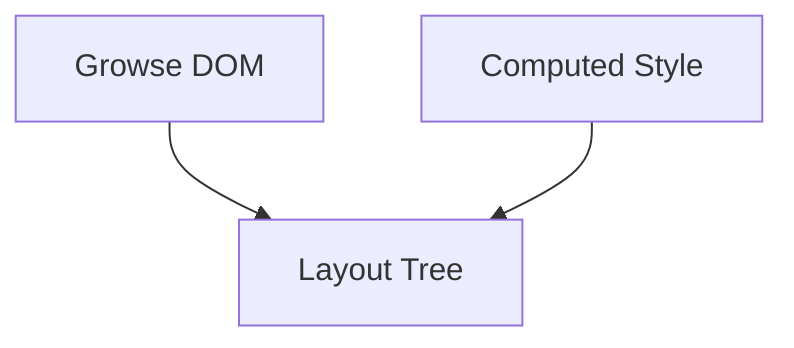

---

# 24. Layout Box

概念上以下の構造を持つ。

```go
type LayoutBox struct {
    NodeID NodeID

    X float32
    Y float32

    Width  float32
    Height float32

    Margin  Edges
    Border  Edges
    Padding Edges

    Children []*LayoutBox
}
```

---

# 25. Box Model

以下を実装する。

```text
┌──────────── margin ────────────┐
│ ┌───────── border ───────────┐ │
│ │ ┌──────── padding ───────┐ │ │
│ │ │                        │ │ │
│ │ │       content          │ │ │
│ │ │                        │ │ │
│ │ └────────────────────────┘ │ │
│ └────────────────────────────┘ │
└────────────────────────────────┘
```

---

# 26. Block Layout

以下を縦方向へ配置できる。

```html
<div>A</div>
<div>B</div>
<div>C</div>
```

期待結果：

```text
A
B
C
```

---

# 27. Inline Layout

以下を1行上へ配置できる。

```html
<span>Hello</span>
<span>Growse</span>
```

期待結果：

```text
Hello Growse
```

テキスト折返しについては簡易実装でよい。

---

# 28. Flex / Grid

MVPでは以下を対象外とする。

```text
Flexbox
CSS Grid
```

---

# 29. Paint Engine

Layout Engineから直接Gioを呼ばない。

一度Display Listへ変換する。

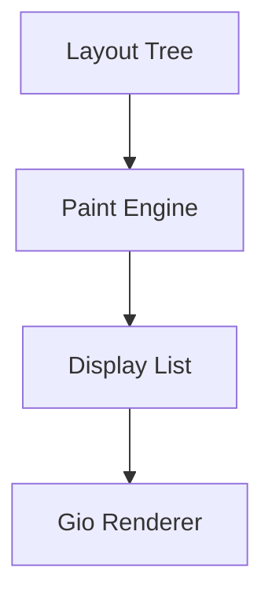

---

# 30. Display List

最低限以下の描画命令を定義する。

```go
type PaintCommand interface {
    paintCommand()
}

type DrawRect struct {
    X float32
    Y float32

    Width  float32
    Height float32

    Color Color
}

type DrawText struct {
    X float32
    Y float32

    Text string

    Size  float32
    Color Color
}

type DrawImage struct {
    // ...
}
```

---

# 31. Gio Renderer

Display ListをGio描画命令へ変換する。

```text
DrawRect
 ↓
Gio rectangle

DrawText
 ↓
Gio text

DrawImage
 ↓
Gio image
```

これにより、GrowseのレイアウトエンジンとGUIフレームワークを分離する。

---

# 32. Scrolling

WebページがViewportの高さを超えた場合、縦方向へスクロールできる。

MVPでは、

```text
Vertical Scroll
```

のみ必須とする。

Horizontal Scrollは任意とする。

---

# 33. Hit Testing

クリック位置からDOM要素を特定できること。

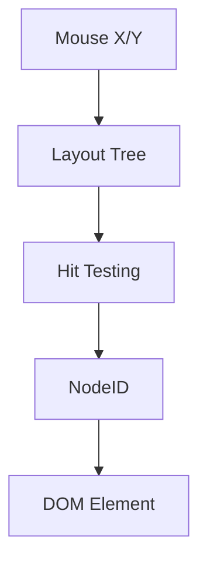

主に、

* `<button>`
* `<a>`

へ使用する。

---

# 34. Link

以下をクリックするとページ遷移する。

```html
<a href="/about">
    About
</a>
```

処理：

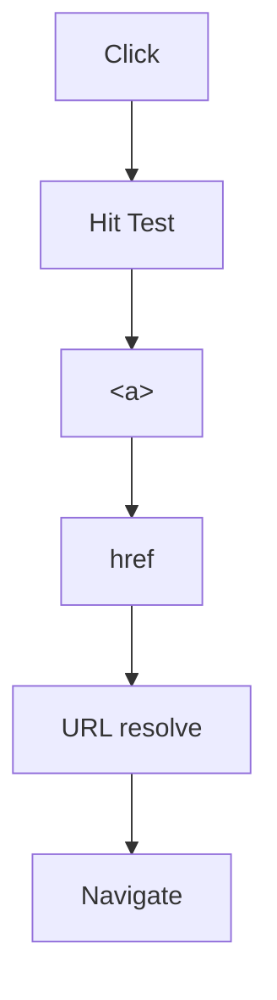

---

# 35. Go Script

以下の形式をGrowse独自scriptとして認識する。

## Inline

```html
<script type="text/go">
package main

func main() {
}
</script>
```

## External

```html
<script type="text/go" src="/app.go"></script>
```

MVPでは外部ファイル形式を優先する。

---

# 36. Go Runtime

MVPのGo実行エンジンとしてYaegiを使用する。

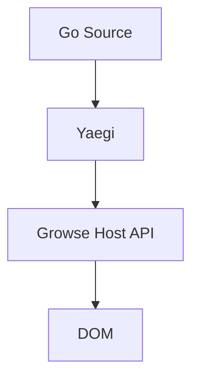

ただしGrowse内部ではYaegiへ直接依存させない。

---

# 37. Runtime Interface

以下のような抽象化を行う。

```go
type Runtime interface {
    Load(source string) error

    Run(ctx context.Context) error

    Stop() error
}
```

実装：

```text
runtime.Runtime
       │
       └── yaegi.Runtime
```

これにより将来、

```text
Yaegi
 ↓
独自Growse Runtime
```

へ置き換えられる構造とする。

---

# 38. Go Entry Point

Go Scriptは以下を基本形式とする。

```go
package main

func main() {
}
```

ページロード完了後、

```text
main()
```

を一度実行する。

---

# 39. Growse Browser API

Webページ側のGoコードからブラウザ機能へアクセスするため、独自APIを提供する。

MVP：

```text
growse/dom
growse/events
growse/console
growse/strconv
```

将来的には、

```text
growse/http
growse/json
growse/storage
growse/timer
growse/url
```

を追加できる。

---

# 40. DOM API

## 40.1 GetElementByID

```go
element := dom.GetElementByID("button")
```

## 40.2 QuerySelector

```go
element := dom.QuerySelector(".card")
```

MVPでは、

```text
#id
.class
tag
```

程度でよい。

## 40.3 SetText

```go
element.SetText("Hello")
```

## 40.4 Text

```go
text := element.Text()
```

## 40.5 SetAttribute

```go
element.SetAttribute(
    "class",
    "active",
)
```

## 40.6 GetAttribute

```go
value := element.GetAttribute("class")
```

---

# 41. Event API

最低限、

```text
click
```

を実装する。

公開API：

```go
button.OnClick(func() {
    // ...
})
```

内部的には、

```go
element.On(
    "click",
    handler,
)
```

として実装してもよい。

---

# 42. Event Dispatch

処理フロー：

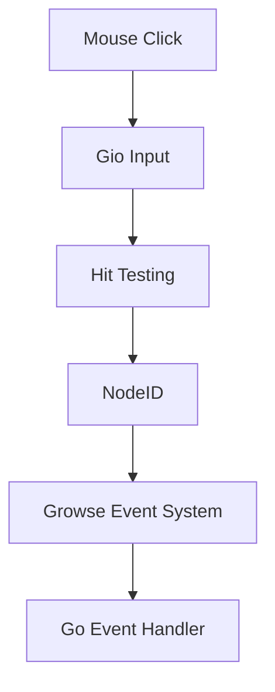

---

# 43. DOM Mutation

GoからDOMが変更された場合、

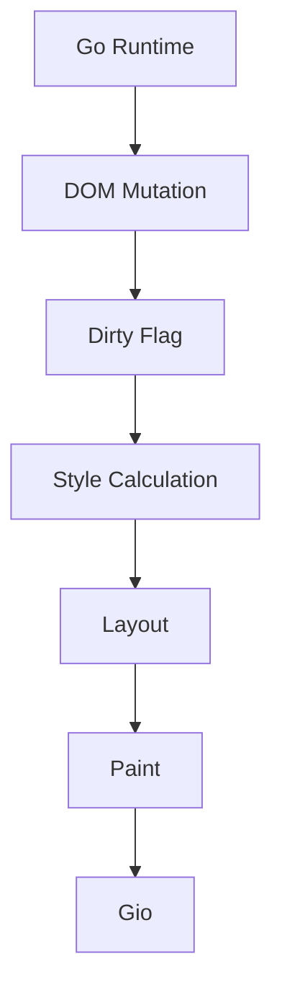

によって画面へ反映する。

MVPではDOM変更のたびにページ全体を再計算してよい。

差分Layoutは対象外とする。

---

# 44. Console API

以下を提供する。

```go
console.Log("Hello Growse")
```

MVPでは標準出力へ表示してよい。

例：

```text
[Growse] Hello Growse
```

---

# 45. Go標準ライブラリの扱い

Growse上で動くGoコードへ、任意のGo標準ライブラリを公開してはならない。

特に以下は禁止する。

```text
os
os/exec
syscall
unsafe
runtime
plugin
net
net/http
```

WebページからOS資源へ直接アクセスさせない。

---

# 46. セキュリティ方針

Webページ上のGoコードは、

```text
Untrusted Code
```

として扱う。

ただしMVPではYaegiを完全なセキュリティSandboxとはみなさない。

そのためMVP v0.1.0では、**任意のインターネットサイトのGoコードを安全に実行することを保証しない。**

---

# 47. MVP Runtime 制限

v0.1.0ではGoコードの実行を、

```text
localhost
```

または、

```text
ユーザーが明示的に信頼したOrigin
```

に制限する設計とする。

初期実装では、

```text
http://localhost
http://127.0.0.1
```

のみGo Scriptを自動実行してよい。

その他OriginではGoコードを実行せず警告を表示する。

---

# 48. 将来のSandbox

将来的には、

```text
Go Source
 ↓
Growse Compiler
 ↓
Growse Bytecode
 ↓
Sandboxed Growse VM
```

のような独自実行環境へ置換可能とする。

必要機能：

* Memory Limit
* CPU Limit
* Instruction Limit
* Goroutine Limit
* Network Policy
* Origin Policy
* API Permission
* Runtime Termination

---

# 49. Runtime停止

ページを離れた場合、そのページで動作しているGo Runtimeを停止する。

```text
Page A Runtime
 ↓
Navigate Page B
 ↓
Page A Runtime Stop
 ↓
Page B Runtime Start
```

---

# 50. Runtime Error

Goコードにエラーがあってもブラウザ全体をクラッシュさせない。

例：

```text
Growse Runtime Error

/app.go:18

undefined: foo
```

エラーをログへ表示し、ページ自体は可能な範囲で表示する。

---

# 51. HTML Error

HTML解析失敗時もGrowseを終了しない。

可能な限り解析を継続する。

---

# 52. CSS Error

不正なCSSルールは無視し、その他のルールを処理する。

---

# 53. 画像

MVPでは以下を対応する。

```text
PNG
JPEG
```

使用：

```html

```

GIF、SVG、WebPはMVP対象外とする。

---

# 54. タイトル

HTML：

```html
<title>Growse Demo</title>
```

をブラウザウィンドウタイトルへ反映できること。

---

# 55. MVP対応OS

第一ターゲット：

```text
Linux
Ubuntu 24.04+
amd64
```

とする。

将来的には、

```text
Windows
macOS
Linux arm64
```

へ拡張可能な構造とする。

---

# 56. 実装言語

Growse本体の実装言語は、

```text
Go
```

とする。

主要ブラウザロジックを、

```text
C
C++
Rust
JavaScript
```

で実装しない。

依存ライブラリ内部でOS APIやネイティブコードを利用することは許容する。

---

# 57. アーキテクチャ

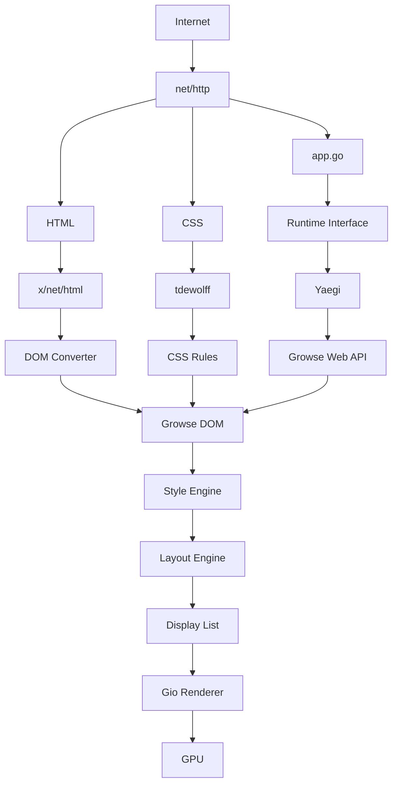

---

# 58. Browser内部構成

```text
growse/
├── cmd/
│   └── growse/
│       └── main.go
│
├── internal/
│   ├── browser/
│   │   ├── browser.go
│   │   ├── navigation.go
│   │   ├── history.go
│   │   └── page.go
│   │
│   ├── network/
│   │   ├── client.go
│   │   ├── request.go
│   │   └── resource.go
│   │
│   ├── html/
│   │   ├── parser.go
│   │   └── converter.go
│   │
│   ├── dom/
│   │   ├── document.go
│   │   ├── node.go
│   │   ├── element.go
│   │   ├── mutation.go
│   │   └── selector.go
│   │
│   ├── css/
│   │   ├── parser.go
│   │   ├── rule.go
│   │   ├── selector.go
│   │   ├── specificity.go
│   │   └── cascade.go
│   │
│   ├── style/
│   │   ├── style.go
│   │   ├── computed.go
│   │   └── length.go
│   │
│   ├── layout/
│   │   ├── layout.go
│   │   ├── box.go
│   │   ├── block.go
│   │   ├── inline.go
│   │   └── text.go
│   │
│   ├── paint/
│   │   ├── painter.go
│   │   ├── command.go
│   │   └── display_list.go
│   │
│   ├── renderer/
│   │   └── gio/
│   │       ├── renderer.go
│   │       ├── text.go
│   │       └── image.go
│   │
│   ├── runtime/
│   │   ├── runtime.go
│   │   └── yaegi/
│   │       ├── runtime.go
│   │       ├── symbols.go
│   │       └── loader.go
│   │
│   ├── events/
│   │   ├── event.go
│   │   ├── dispatcher.go
│   │   └── hit_test.go
│   │
│   ├── webapi/
│   │   ├── dom/
│   │   ├── events/
│   │   ├── console/
│   │   └── strconv/
│   │
│   └── ui/
│       ├── app.go
│       ├── toolbar.go
│       ├── address_bar.go
│       └── viewport.go
│
├── examples/
│   └── counter/
│       ├── index.html
│       ├── style.css
│       └── app.go
│
├── docs/
│
├── go.mod
├── go.sum
└── README.md
```

---

# 59. コンポーネント間依存方針

依存方向を以下とする。

```text
UI
 ↓
Browser
 ↓
DOM / Style / Layout / Runtime
 ↓
Paint
 ↓
Renderer
```

Gio固有コードを、

```text
DOM
CSS
Layout
Runtime
```

へ持ち込まない。

これにより将来的にRendererを交換可能とする。

---

# 60. Runtime依存方針

Yaegi固有コードも、

```text
internal/runtime/yaegi/
```

へ隔離する。

Growse本体からは、

```go
Runtime
```

interfaceのみを使用する。

---

# 61. ページロード処理

```text
Navigation Request
 ↓
HTTP GET
 ↓
HTML Parse
 ↓
Growse DOM生成
 ↓
Stylesheet抽出
 ↓
CSS取得
 ↓
CSS Parse
 ↓
Computed Style生成
 ↓
Layout
 ↓
Paint
 ↓
First Render
 ↓
Go Script抽出
 ↓
Go Source取得
 ↓
Runtime Load
 ↓
main()実行
```

---

# 62. DOM更新処理

```text
Go Event Handler
 ↓
DOM.SetText()
 ↓
DOM Mutation
 ↓
Page Dirty
 ↓
Style Recalculation
 ↓
Layout
 ↓
Paint
 ↓
Render
```

MVPでは毎回フル再計算してよい。

---

# 63. 実装フェーズ

## Phase 1 — Gio Window

完成条件：

* Growseウィンドウが開く
* URL入力欄を表示する
* 矩形を描画する
* テキストを描画する

---

## Phase 2 — Network

完成条件：

```text
http://localhost:8080
```

からHTMLを取得し、標準出力へ表示できる。

---

## Phase 3 — DOM

完成条件：

```html
<body>
    <h1>Hello</h1>
    <p>Growse</p>
</body>
```

から、

```text
body
├── h1
│   └── "Hello"
└── p
    └── "Growse"
```

を生成できる。

---

## Phase 4 — Basic Rendering

完成条件：

```html
<h1>Hello Growse</h1>
<p>Go powered browser.</p>
```

を画面へ表示できる。

---

## Phase 5 — Layout

完成条件：

* block layout
* inline text
* margin
* padding
* width
* height

が動作する。

---

## Phase 6 — CSS

完成条件：

```css
h1 {
    font-size: 32px;
}

.card {
    padding: 20px;
}
```

が表示へ反映される。

---

## Phase 7 — Navigation

完成条件：

```html
<a href="/page2.html">
    Next
</a>
```

をクリックしてページ遷移できる。

---

## Phase 8 — Go Runtime

完成条件：

```html
<script type="text/go" src="/app.go"></script>
```

からGoソースコードを取得できる。

```go
package main

import "growse/console"

func main() {
    console.Log("Hello from Go")
}
```

が実行できる。

---

## Phase 9 — DOM Binding

完成条件：

```go
dom.GetElementByID("message").
    SetText("Hello from Go")
```

によって画面上の文字を変更できる。

---

## Phase 10 — Event

完成条件：

```go
button.OnClick(func() {
    // ...
})
```

がブラウザのクリックイベントによって呼び出される。

---

## Phase 11 — Counter Demo

以下をすべて統合する。

```text
HTML
CSS
Go
DOM
Layout
Render
Event
```

Counter Demoが動作した時点を、

```text
Growse v0.1.0
```

とする。

---

# 64. MVP非対象

v0.1.0では以下を実装しない。

* JavaScript
* TypeScript
* WebAssemblyによるGo実行
* CSS Flexbox
* CSS Grid
* CSS Animation
* CSS Transition
* WebSocket
* WebRTC
* WebGL
* WebGPU
* Canvas
* Audio
* Video
* iframe
* Shadow DOM
* Web Components
* LocalStorage
* IndexedDB
* Service Worker
* PWA
* Browser Extensions
* DevTools
* 複数タブ
* HTTP/3
* QUIC
* SVG
* GIF Animation
* Chrome互換性
* Firefox互換性
* HTML Living Standard完全準拠
* CSS完全準拠

---

# 65. パフォーマンス要件

MVPではChrome等との性能競争は行わない。

ローカルデモページに対して、

* ページロードが実用上問題ない時間で完了する
* スクロール操作が可能である
* ボタンクリックが即座に反映される
* DOM更新後の再描画が人間操作で問題にならない

ことを目標とする。

---

# 66. 安定性要件

以下が発生してもGrowseプロセス全体が即座にクラッシュしないこと。

* 不正HTML
* 不正CSS
* Go Compile Error
* Go Runtime Error
* HTTP 404
* HTTP Connection Error
* 画像読み込み失敗

---

# 67. ログ

MVPでは標準出力へログを出力する。

例：

```text
[Growse] navigating: http://localhost:8080
[Growse] document loaded
[Growse] stylesheet loaded: /style.css
[Growse] go script loaded: /app.go
[Growse] runtime started
[WebGo] Hello from Go
```

---

# 68. MVPセキュリティ制約

v0.1.0では以下を明示する。

> Growse MVPのGo Runtimeは技術実証用であり、インターネット上の信頼できない任意Goコードを安全に実行できるSandboxを提供するものではない。

そのため開発段階では、

```text
localhost
```

上のGrowse専用Webアプリケーションを主要対象とする。

---

# 69. Growse v0.1.0 完了条件

以下をすべて満たすこと。

* [x] Linux上でGrowseがネイティブアプリとして起動する
* [x] GioによるBrowser UIが表示される
* [x] URLを入力できる
* [x] HTTPページを取得できる
* [x] HTTPSページを取得できる
* [x] HTMLを解析できる
* [x] Growse独自DOMへ変換できる
* [x] 基本HTMLを画面へ描画できる
* [x] CSSを読み込める
* [x] CSS Selectorが動作する
* [x] CSS Cascadeが動作する
* [x] Computed Styleを生成できる
* [x] Block Layoutが動作する
* [x] Inline Textが動作する
* [x] Box Modelが動作する
* [x] Display Listを生成できる
* [x] Gio RendererでDisplay Listを描画できる
* [x] 縦スクロールできる
* [x] Hit Testingが動作する
* [x] `<a>` をクリックしてページ遷移できる
* [x] Backが動作する
* [x] Reloadが動作する
* [x] `<script type="text/go">` を認識できる
* [x] `.go` ファイルを取得できる
* [ ] Yaegi Runtimeが起動する
* [ ] `main()` を実行できる
* [ ] `growse/console` が利用できる
* [ ] `growse/dom` が利用できる
* [ ] GoからDOM要素を取得できる
* [ ] GoからDOMのTextを変更できる
* [ ] クリックイベントをGoへDispatchできる
* [ ] Goから登録した `OnClick` が実行される
* [ ] DOM Mutation後に再描画される
* [x] JavaScriptを実行しない
* [x] JavaScript Engineを搭載しない
* [x] Goコードの実行にWebAssemblyを使用しない
* [x] WebView・Chromium・WebKit等を使用しない
* [ ] Counter Demoが正常に動作する

---

# 70. Growse v0.1.0 の定義

Growse v0.1.0を以下のように定義する。

> **HTMLとCSSを独自ブラウザエンジンで表示し、JavaScriptの代わりにGoソースコードをブラウザ内部のGo Runtimeで実行し、GoからDOM操作およびイベント処理を行えるLinux向けネイティブWebブラウザ。**

Growseの本質は、

```text
Goで書かれたブラウザ
```

だけではなく、

```text
HTML + CSS + Go
```

というWebアプリケーションモデルそのものを実現することにある。

最終的には、

```go
package main

import (
    "growse/dom"
    "growse/http"
)

func main() {
    button := dom.GetElementByID("load")

    button.OnClick(func() {
        go func() {
            response, err := http.Get("/api/user")
            if err != nil {
                return
            }

            dom.GetElementByID("result").
                SetText(response.Text())
        }()
    })
}
```

のように、Goの、

```text
goroutine
channel
select
struct
interface
defer
```

といった言語機能をブラウザ上のWebアプリケーション開発へ持ち込めるプラットフォームへ発展させる。

MVPでは、その第一歩として、

> **GoコードがWebページから読み込まれ、そのGoコードによってDOMが実際に動く**

ところまでを実装する。
