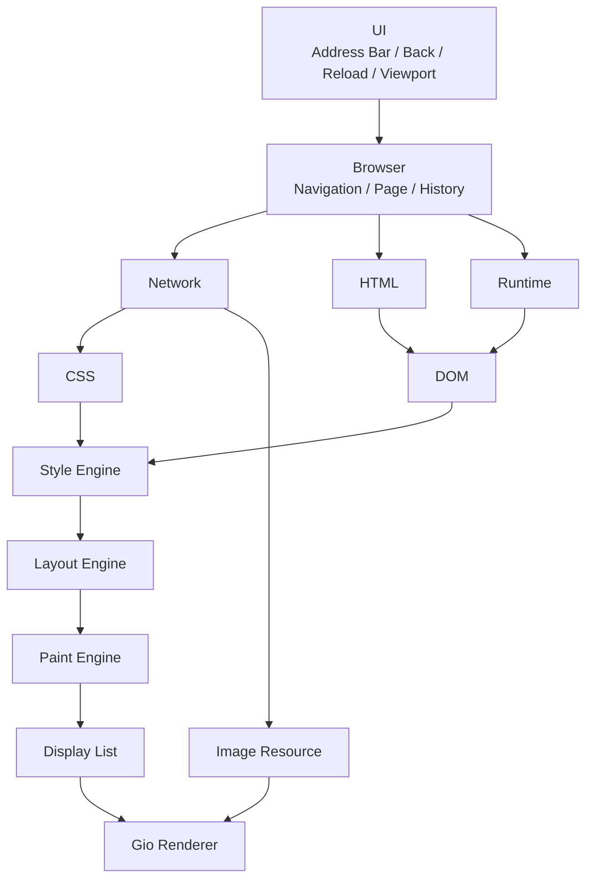
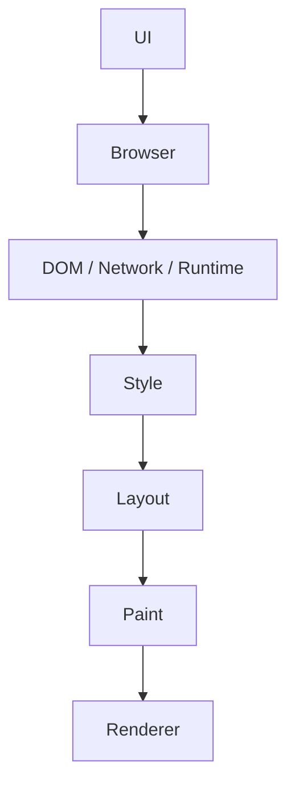
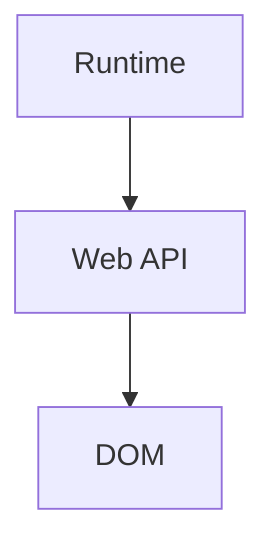
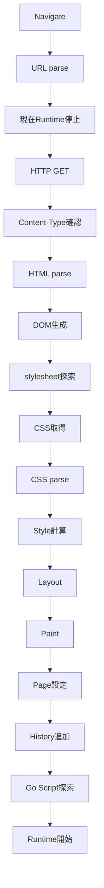
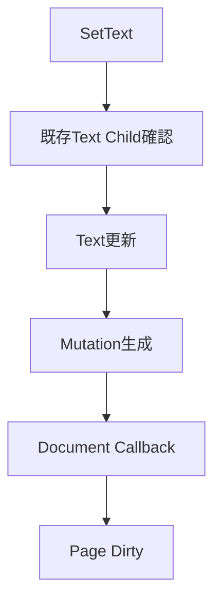
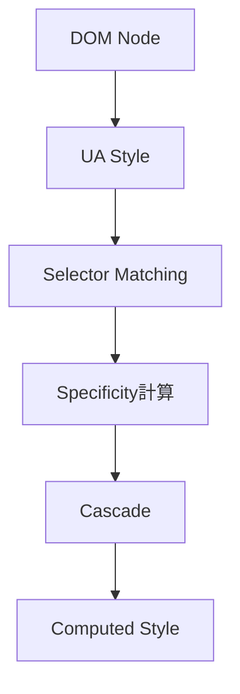
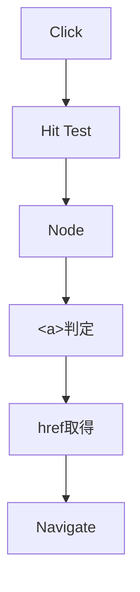
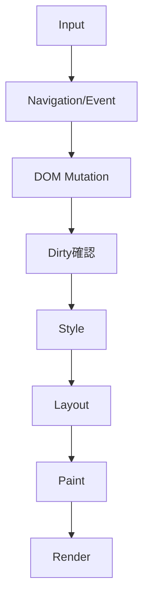
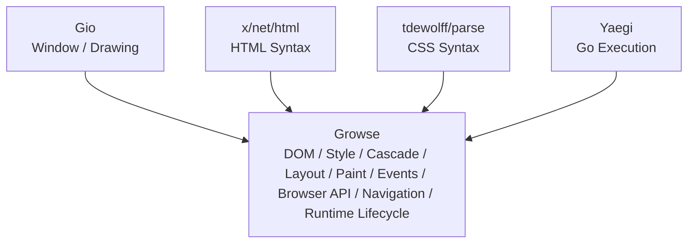

# Growse MVP 詳細設計書

## 1. 文書概要

### 1.1 文書名

**Growse MVP 詳細設計書**

### 1.2 対象バージョン

```text
Growse v0.1.0
```

### 1.3 本書の目的

本書は、Growse v0.1.0 を実装するために必要な内部アーキテクチャ、モジュール構成、データ構造、インターフェース、処理フロー、エラー処理、テスト方針を定義する。

Growseは、

```text
HTML
CSS
Go
```

でWebアプリケーションを構成する独自Webブラウザである。

JavaScriptを実行せず、GoコードをWebAssemblyへ変換することもなく、ブラウザ内部のGo Runtimeによって実行する。

---

# 2. システム方針

## 2.1 基本原則

Growseは以下の原則に従って実装する。

1. ブラウザ本体はGoで実装する
2. JavaScript Engineを搭載しない
3. WebViewを使用しない
4. Chromium / WebKit / Gecko等を利用しない
5. HTML/CSSの構文解析には既存ライブラリを利用する
6. DOM / Style / Layout / Paint / Event SystemはGrowse側で管理する
7. Go Runtimeは抽象化する
8. MVPではYaegiをGo Runtime実装として利用する
9. Gio固有処理をRenderer/UI層以外へ持ち込まない
10. MVPでは安全性の保証されていない外部Goコードを自動実行しない

---

# 3. 技術スタック

| 領域             | 採用技術                               |
| -------------- | ---------------------------------- |
| 言語             | Go                                 |
| GUI            | Gio                                |
| HTTP           | `net/http`                         |
| URL            | `net/url`                          |
| HTML Parser    | `golang.org/x/net/html`            |
| CSS Parser     | `github.com/tdewolff/parse/v2/css` |
| Go Interpreter | `github.com/traefik/yaegi`         |
| DOM            | 自作                                 |
| Style Engine   | 自作                                 |
| Layout Engine  | 自作                                 |
| Paint Engine   | 自作                                 |
| Event System   | 自作                                 |
| Renderer       | Gio                                |
| Logging        | `log/slog`                         |
| Testing        | `testing`                          |

---

# 4. システム全体構成



---

# 5. ディレクトリ構成

```text
growse/
├── cmd/
│   └── growse/
│       └── main.go
│
├── internal/
│   ├── app/
│   │   └── app.go
│   │
│   ├── browser/
│   │   ├── browser.go
│   │   ├── page.go
│   │   ├── navigation.go
│   │   ├── history.go
│   │   └── lifecycle.go
│   │
│   ├── network/
│   │   ├── client.go
│   │   ├── request.go
│   │   ├── response.go
│   │   ├── resource.go
│   │   └── mime.go
│   │
│   ├── html/
│   │   ├── parser.go
│   │   ├── converter.go
│   │   └── scripts.go
│   │
│   ├── dom/
│   │   ├── document.go
│   │   ├── node.go
│   │   ├── element.go
│   │   ├── attribute.go
│   │   ├── selector.go
│   │   ├── mutation.go
│   │   └── id.go
│   │
│   ├── css/
│   │   ├── parser.go
│   │   ├── stylesheet.go
│   │   ├── rule.go
│   │   ├── selector.go
│   │   ├── declaration.go
│   │   ├── specificity.go
│   │   └── value.go
│   │
│   ├── style/
│   │   ├── engine.go
│   │   ├── computed.go
│   │   ├── display.go
│   │   ├── color.go
│   │   ├── length.go
│   │   └── edges.go
│   │
│   ├── layout/
│   │   ├── engine.go
│   │   ├── tree.go
│   │   ├── box.go
│   │   ├── block.go
│   │   ├── inline.go
│   │   ├── text.go
│   │   ├── geometry.go
│   │   └── viewport.go
│   │
│   ├── paint/
│   │   ├── engine.go
│   │   ├── display_list.go
│   │   └── command.go
│   │
│   ├── renderer/
│   │   ├── renderer.go
│   │   └── gio/
│   │       ├── renderer.go
│   │       ├── rect.go
│   │       ├── text.go
│   │       └── image.go
│   │
│   ├── runtime/
│   │   ├── runtime.go
│   │   ├── script.go
│   │   ├── origin.go
│   │   └── yaegi/
│   │       ├── runtime.go
│   │       ├── symbols.go
│   │       ├── loader.go
│   │       └── errors.go
│   │
│   ├── webapi/
│   │   ├── context.go
│   │   ├── dom/
│   │   │   ├── package.go
│   │   │   └── element.go
│   │   ├── console/
│   │   │   └── package.go
│   │   └── strconv/
│   │       └── package.go
│   │
│   ├── events/
│   │   ├── event.go
│   │   ├── dispatcher.go
│   │   ├── listener.go
│   │   └── hit_test.go
│   │
│   ├── ui/
│   │   ├── window.go
│   │   ├── toolbar.go
│   │   ├── address_bar.go
│   │   └── viewport.go
│   │
│   └── logging/
│       └── logger.go
│
├── examples/
│   └── counter/
│       ├── index.html
│       ├── style.css
│       └── app.go
│
├── testdata/
│   ├── html/
│   ├── css/
│   └── pages/
│
├── docs/
│
├── go.mod
├── go.sum
└── README.md
```

---

# 6. 依存方向

パッケージ間の依存方向を以下に限定する。



ただしRuntimeはWeb APIを介してDOMへアクセスする。



以下は禁止する。

```text
DOM → Gio
Style → Gio
Layout → Gio
Runtime → Gio
CSS → Gio
```

これによりブラウザロジックと描画フレームワークを分離する。

---

# 7. エントリポイント

## 7.1 `cmd/growse/main.go`

責務はアプリケーション起動のみとする。

```go
func main() {
    if err := app.Run(); err != nil {
        log.Fatal(err)
    }
}
```

ロジックを `main.go` へ記述しない。

---

# 8. App

## 8.1 App構造体

```go
type App struct {
    browser  *browser.Browser
    window   *ui.Window
    renderer renderer.Renderer
}
```

## 8.2 責務

* Browser生成
* Renderer生成
* UI生成
* Gio event loop開始
* 終了処理

---

# 9. Browser設計

Browserは1つのブラウザウィンドウを表す。

MVPではタブを持たない。

```go
type Browser struct {
    page    *Page
    history *History
    client  *network.Client
    runtime runtime.Runtime
}
```

---

# 10. Page設計

Pageは現在読み込まれている1ページの状態を保持する。

```go
type Page struct {
    URL *url.URL

    Document   *dom.Document
    Stylesheet *css.Stylesheet

    LayoutTree *layout.Tree
    DisplayList *paint.DisplayList

    Scripts []runtime.Script

    Runtime runtime.Runtime

    Dirty DirtyState
}
```

---

# 11. Dirty State

DOM更新時に再計算対象を管理する。

```go
type DirtyState struct {
    Style  bool
    Layout bool
    Paint  bool
}
```

MVPでは単純化のためDOM更新時にすべてtrueにしてよい。

```go
func (p *Page) MarkDirty() {
    p.Dirty.Style = true
    p.Dirty.Layout = true
    p.Dirty.Paint = true
}
```

---

# 12. Navigation設計

## 12.1 API

```go
func (b *Browser) Navigate(
    ctx context.Context,
    rawURL string,
) error
```

---

# 13. Navigation処理



---

# 14. Navigation State

ページロード状態を定義する。

```go
type LoadState int

const (
    LoadStateIdle LoadState = iota
    LoadStateLoading
    LoadStateLoaded
    LoadStateFailed
)
```

Browserに保持する。

```go
type Browser struct {
    state LoadState
    // ...
}
```

---

# 15. History設計

```go
type History struct {
    entries []*url.URL
    index   int
}
```

## 15.1 Push

```go
func (h *History) Push(u *url.URL)
```

現在indexより後ろに履歴が存在する場合は削除する。

---

## 15.2 Back

```go
func (h *History) Back() (*url.URL, bool)
```

MVPではForward APIは不要。

---

# 16. Network Client

## 16.1 構造

```go
type Client struct {
    httpClient *http.Client
}
```

## 16.2 HTTP Client設定

```go
&http.Client{
    Timeout: 15 * time.Second,
}
```

リダイレクトはGo標準挙動を利用する。

---

# 17. Resource

HTTP取得結果を統一構造として扱う。

```go
type Resource struct {
    URL         *url.URL
    StatusCode  int
    ContentType string
    Body        []byte
}
```

---

# 18. Resource取得API

```go
func (c *Client) Fetch(
    ctx context.Context,
    u *url.URL,
) (*Resource, error)
```

---

# 19. サイズ制限

異常に大きなリソースを読み込まないようMVPから上限を設定する。

```go
const (
    MaxHTMLSize   = 5 << 20
    MaxCSSSize    = 2 << 20
    MaxScriptSize = 2 << 20
    MaxImageSize  = 10 << 20
)
```

---

# 20. MIME判定

主に以下を認識する。

```text
text/html
text/css
text/go
image/png
image/jpeg
```

`Content-Type` が存在しない場合は拡張子から補助判定してよい。

---

# 21. HTML Parser

## 21.1 Interface

```go
type Parser interface {
    Parse(r io.Reader) (*dom.Document, error)
}
```

---

# 22. HTML変換

`x/net/html` が返したNodeをGrowse DOMへ変換する。

```text
html.Node
 ↓
convertNode()
 ↓
dom.Node
```

---

# 23. DOM Node Type

```go
type NodeType uint8

const (
    NodeDocument NodeType = iota
    NodeElement
    NodeText
)
```

---

# 24. Node ID

全DOM Nodeへ一意なIDを割り当てる。

```go
type NodeID uint64
```

NodeIDはdocument単位で採番する。

```go
type IDGenerator struct {
    next NodeID
}
```

---

# 25. DOM Node

```go
type Node struct {
    ID NodeID

    Type NodeType

    TagName string
    Text    string

    Attributes map[string]string

    Parent   *Node
    Children []*Node
}
```

---

# 26. Document

```go
type Document struct {
    Root *Node

    byID map[string]*Node

    nextID NodeID

    onMutation func(Mutation)
}
```

`id` attribute検索を高速化するためindexを持つ。

---

# 27. DOM Mutation

```go
type MutationType uint8

const (
    MutationText MutationType = iota
    MutationAttribute
    MutationChild
)
```

```go
type Mutation struct {
    Type   MutationType
    NodeID NodeID
}
```

---

# 28. DOM Mutation Callback

Document生成時にBrowser側からcallbackを登録する。

```go
document.SetMutationHandler(func(m dom.Mutation) {
    page.MarkDirty()
})
```

これによりWebGoからDOMを書き換えた際に再描画可能となる。

---

# 29. DOM API

## 29.1 GetElementByID

```go
func (d *Document) GetElementByID(
    id string,
) (*Element, bool)
```

---

# 30. Element Wrapper

Nodeを直接公開せずElementとして扱う。

```go
type Element struct {
    document *Document
    node     *Node
}
```

---

# 31. Element API

```go
func (e *Element) ID() NodeID

func (e *Element) TagName() string

func (e *Element) Text() string

func (e *Element) SetText(value string)

func (e *Element) Attribute(name string) (string, bool)

func (e *Element) SetAttribute(name, value string)

func (e *Element) Children() []*Element
```

---

# 32. SetText処理



---

# 33. QuerySelector

MVPでは以下のみ対応する。

```text
#id
.class
tag
tag.class
```

API：

```go
func (d *Document) QuerySelector(
    selector string,
) (*Element, bool)
```

---

# 34. Script探索

HTML内の以下を探索する。

```html
<script type="text/go" src="/app.go"></script>
```

および、

```html
<script type="text/go">
...
</script>
```

---

# 35. Script構造

```go
type Script struct {
    SourceURL *url.URL

    Source string

    Inline bool
}
```

---

# 36. JavaScript script

以下はRuntimeへ渡さない。

```html
<script>
```

```html
<script type="text/javascript">
```

ログのみ出力する。

```text
Growse: JavaScript is not supported.
```

---

# 37. CSSモデル

## 37.1 Stylesheet

```go
type Stylesheet struct {
    Rules []Rule
}
```

---

# 38. Rule

```go
type Rule struct {
    Selector     Selector
    Declarations []Declaration
    Order        int
}
```

`Order` は同specificity時の後勝ち判定に使用する。

---

# 39. Selector

```go
type Selector struct {
    Tag   string
    ID    string
    Class string
}
```

MVPでは1 selectorにつき、

```text
tag
id
class
```

を最大1つずつ持つ。

---

# 40. Specificity

```go
type Specificity struct {
    ID    int
    Class int
    Tag   int
}
```

比較順：

```text
ID
 ↓
Class
 ↓
Tag
 ↓
Rule Order
```

---

# 41. Declaration

```go
type Declaration struct {
    Property string
    Value    Value
}
```

---

# 42. CSS Value

```go
type ValueKind uint8

const (
    ValueKeyword ValueKind = iota
    ValueLength
    ValueColor
)
```

```go
type Value struct {
    Kind ValueKind

    Keyword string
    Length  style.Length
    Color   style.Color
}
```

---

# 43. Length

```go
type LengthUnit uint8

const (
    UnitPx LengthUnit = iota
    UnitPercent
    UnitAuto
)
```

```go
type Length struct {
    Value float32
    Unit  LengthUnit
}
```

MVPでは `px` を最優先とする。

---

# 44. Color

```go
type Color struct {
    R uint8
    G uint8
    B uint8
    A uint8
}
```

対応形式：

```text
#RGB
#RRGGBB

black
white
red
green
blue
gray
transparent
```

---

# 45. Computed Style

```go
type ComputedStyle struct {
    Display Display

    Color           Color
    BackgroundColor Color

    Width  Length
    Height Length

    Margin  Edges
    Padding Edges

    BorderWidth float32
    BorderColor Color

    FontSize   float32
    FontWeight int
}
```

---

# 46. Display

```go
type Display uint8

const (
    DisplayBlock Display = iota
    DisplayInline
    DisplayNone
)
```

---

# 47. Default Style

ブラウザ内部に最低限のUser Agent Styleを持つ。

例：

```text
html  → block
body  → block
div   → block
main  → block
p     → block
h1    → block
h2    → block
h3    → block

span   → inline
a      → inline

button → inline
img    → inline
```

---

# 48. UA Style

最低限以下を定義する。

```css
body {
    display: block;
    margin: 8px;
    color: black;
    background-color: white;
    font-size: 16px;
}

h1 {
    display: block;
    font-size: 32px;
    font-weight: 700;
}

h2 {
    display: block;
    font-size: 24px;
    font-weight: 700;
}

p {
    display: block;
}
```

UA stylesheetはコード内定数またはembedded resourceとして保持する。

---

# 49. Style Engine

## 49.1 Interface

```go
type Engine interface {
    Compute(
        document *dom.Document,
        stylesheet *css.Stylesheet,
    ) (*StyledTree, error)
}
```

---

# 50. Styled Node

```go
type StyledNode struct {
    NodeID dom.NodeID

    Style ComputedStyle

    Children []*StyledNode
}
```

---

# 51. Style計算



---

# 52. Layout Geometry

```go
type Point struct {
    X float32
    Y float32
}

type Size struct {
    Width  float32
    Height float32
}

type Rect struct {
    X      float32
    Y      float32
    Width  float32
    Height float32
}
```

---

# 53. Edges

```go
type Edges struct {
    Top    float32
    Right  float32
    Bottom float32
    Left   float32
}
```

---

# 54. Layout Box

```go
type BoxType uint8

const (
    BoxBlock BoxType = iota
    BoxInline
    BoxText
)
```

```go
type Box struct {
    Type BoxType

    NodeID dom.NodeID

    Content Rect

    Margin  Edges
    Border  Edges
    Padding Edges

    Text string

    Style style.ComputedStyle

    Children []*Box
}
```

---

# 55. Layout Tree

```go
type Tree struct {
    Root *Box

    byNodeID map[dom.NodeID]*Box
}
```

`byNodeID` はHit Testingおよびデバッグ用。

---

# 56. Viewport

```go
type Viewport struct {
    Width  float32
    Height float32

    ScrollY float32
}
```

---

# 57. Block Layout

block要素は親Content Widthを基準に縦方向へ配置する。

基本式：

```text
outer width
=
margin-left
+
border-left
+
padding-left
+
content-width
+
padding-right
+
border-right
+
margin-right
```

---

# 58. Block Width

widthがautoの場合、

```text
content width
=
parent width
-
margin
-
border
-
padding
```

とする。

MVPではCSS仕様完全準拠より実装単純性を優先する。

---

# 59. Block Height

height指定がない場合、

```text
height
=
children total height
```

で算出する。

---

# 60. Inline Layout

inline要素およびTextは現在のLine Boxへ配置する。

```text
line widthを超える
 ↓
次のlineへ移動
```

---

# 61. Text Measurement

文字幅計算にはGioのtext shaping機能を使用してよい。

ただしLayout側からGioへ直接依存させない。

抽象interfaceを定義する。

```go
type TextMeasurer interface {
    Measure(
        text string,
        size float32,
        maxWidth float32,
    ) TextMetrics
}
```

---

# 62. TextMetrics

```go
type TextMetrics struct {
    Width  float32
    Height float32

    Lines []TextLine
}
```

Renderer/Gio側で実装する。

---

# 63. Scroll

Layout座標はdocument座標で保持する。

Renderer時に、

```text
renderY
=
documentY
-
ScrollY
```

とする。

DOM/Layout Tree自体をスクロールによって変更しない。

---

# 64. 最大スクロール量

```text
MaxScrollY
=
max(
    0,
    DocumentHeight - ViewportHeight,
)
```

---

# 65. Paint Engine

## 65.1 API

```go
type Engine interface {
    Build(
        tree *layout.Tree,
    ) *DisplayList
}
```

---

# 66. Display List

```go
type DisplayList struct {
    Commands []Command
}
```

---

# 67. Paint Command

```go
type CommandType uint8

const (
    CommandRect CommandType = iota
    CommandText
    CommandBorder
    CommandImage
)
```

---

# 68. DrawRect

```go
type DrawRect struct {
    Rect  layout.Rect
    Color style.Color
}
```

---

# 69. DrawText

```go
type DrawText struct {
    X float32
    Y float32

    Text string

    FontSize float32
    Color    style.Color
}
```

---

# 70. DrawBorder

```go
type DrawBorder struct {
    Rect  layout.Rect
    Width float32
    Color style.Color
}
```

---

# 71. Renderer Interface

```go
type Renderer interface {
    Render(
        list *paint.DisplayList,
        viewport layout.Viewport,
    ) error
}
```

Browser側はGioを知らない。

---

# 72. Gio Renderer

`renderer/gio` の責務：

* Display List → Gio Operation変換
* Clip
* Scroll Offset
* Text Drawing
* Rect Drawing
* Image Drawing

---

# 73. Browser UI

ToolbarはGio Widgetで実装する。

```text
┌─────────────────────────────────────────────────────┐
│ Back │ Reload │ Address Bar                   │ Go │
└─────────────────────────────────────────────────────┘
```

---

# 74. UI State

```go
type Toolbar struct {
    address string

    backButton   widget.Clickable
    reloadButton widget.Clickable
    goButton     widget.Clickable

    editor widget.Editor
}
```

---

# 75. URL入力

EnterキーまたはGoボタンでNavigationを開始する。

入力：

```text
localhost:8080
```

の場合、MVPでは

```text
http://localhost:8080
```

へ補完してよい。

---

# 76. Input Event

Gioから取得するイベント：

* pointer click
* pointer scroll
* keyboard
* text input

---

# 77. Hit Testing

Hit TestingはLayout Tree上で行う。

API：

```go
func HitTest(
    tree *layout.Tree,
    x float32,
    y float32,
) (dom.NodeID, bool)
```

---

# 78. Hit Test座標

Gioから得たViewport座標にScrollYを加算する。

```text
documentY
=
viewportY
+
scrollY
```

---

# 79. Hit Test優先順位

最も深いChild Nodeを優先する。

```text
Root
 ↓
Child
 ↓
GrandChild
 ↓
最深Node
```

---

# 80. Event

```go
type Type string

const (
    EventClick Type = "click"
)
```

---

# 81. Event構造

```go
type Event struct {
    Type Type

    Target dom.NodeID

    X float32
    Y float32
}
```

---

# 82. Listener

```go
type Listener func(Event)
```

---

# 83. Event Dispatcher

```go
type Dispatcher struct {
    listeners map[dom.NodeID]map[Type][]Listener
}
```

---

# 84. AddEventListener

```go
func (d *Dispatcher) AddEventListener(
    nodeID dom.NodeID,
    eventType Type,
    listener Listener,
)
```

---

# 85. Dispatch

```go
func (d *Dispatcher) Dispatch(event Event)
```

MVPではイベントバブリングを実装しない。

対象Nodeに登録されたlistenerのみ実行する。

---

# 86. Linkクリック処理

`<a>` はGrowseネイティブイベントとして処理する。



Go側にclick handlerが登録されている場合は、MVPではGo handlerを先に実行してからNavigateしてよい。

---

# 87. Button

`<button>` は標準動作を持たない。

Go Event Handlerが登録されている場合のみ処理する。

---

# 88. Runtime Interface

```go
type Runtime interface {
    Load(
        ctx context.Context,
        scripts []Script,
        env Environment,
    ) error

    Start(ctx context.Context) error

    Stop() error
}
```

---

# 89. Runtime Environment

```go
type Environment struct {
    Document   *dom.Document
    Events     *events.Dispatcher
    BaseURL    *url.URL
    OnMutation func()
}
```

---

# 90. Yaegi Runtime

```go
type Runtime struct {
    interpreter *interp.Interpreter

    cancel context.CancelFunc
}
```

Runtimeは1 Pageにつき1インスタンスとする。

---

# 91. Runtime生成

Navigationごとに新しいRuntimeを生成する。

```text
Page A
 ↓
Runtime A

Navigate

Runtime A Stop
 ↓
Page B
 ↓
Runtime B
```

状態をページ間で共有しない。

---

# 92. Yaegi初期化

概念：

```go
i := interp.New(interp.Options{})
```

Growseが明示的に許可したsymbolのみ登録する。

---

# 93. 禁止事項

以下のような標準library symbol一括公開は行わない。

```go
i.Use(stdlib.Symbols)
```

---

# 94. Growse Web API

WebGoへ公開するパッケージ：

```text
growse/dom
growse/console
growse/strconv
```

---

# 95. `growse/dom`

WebGo上では以下のAPIを提供する。

```go
func GetElementByID(id string) *Element

func QuerySelector(selector string) *Element
```

---

# 96. WebGo Element

```go
type Element struct {
    id dom.NodeID
}
```

内部Nodeポインタを直接WebGo側へ公開しない。

---

# 97. WebGo Element API

```go
func (e *Element) Text() string

func (e *Element) SetText(value string)

func (e *Element) GetAttribute(
    name string,
) string

func (e *Element) SetAttribute(
    name string,
    value string,
)

func (e *Element) OnClick(
    handler func(),
)
```

---

# 98. Element不存在

以下の場合：

```go
element := dom.GetElementByID("unknown")
```

戻り値は `nil` とする。

WebGo側で通常のGoとして、

```go
if element == nil {
    return
}
```

と処理できる。

---

# 99. `growse/console`

```go
func Log(values ...any)
```

表示例：

```text
[WebGo] Hello
```

---

# 100. `growse/strconv`

MVPではGo標準 `strconv` 全体を公開せず、必要機能をwrapperとして提供する。

```go
func Itoa(v int) string
```

---

# 101. 将来的な標準ライブラリ

MVP後に必要に応じて、

```text
growse/fmt
growse/json
growse/http
growse/timer
```

を追加する。

---

# 102. Go Script形式

```go
package main

import (
    "growse/dom"
    "growse/strconv"
)

func main() {
}
```

---

# 103. Entry Point

すべてのscriptを評価後、

```text
main.main()
```

を呼び出す。

ページにつきEntry Pointは1つとする。

---

# 104. 複数script

以下は許可する。

```html
<script type="text/go" src="/util.go"></script>
<script type="text/go" src="/app.go"></script>
```

読み込み順に評価する。

ただし全scriptは同一package、

```go
package main
```

とする。

---

# 105. Script取得順序

DOM上で出現した順とする。

```text
script 1
 ↓
script 2
 ↓
script 3
```

---

# 106. Inline Script

Inline scriptも同様にScript構造へ変換する。

```go
Script{
    Inline: true,
    Source: "...",
}
```

---

# 107. Origin Policy

MVPでGo Scriptを自動実行可能なOriginを以下に限定する。

```text
http://localhost
http://127.0.0.1
https://localhost
```

---

# 108. Origin判定

```go
func IsTrustedOrigin(u *url.URL) bool
```

概念：

```go
switch u.Hostname() {
case "localhost", "127.0.0.1", "::1":
    return true
default:
    return false
}
```

---

# 109. 外部Origin

外部OriginのGo Scriptを検出した場合：

```text
Growse blocked Go script execution from untrusted origin:
https://example.com
```

とログ出力する。

HTML/CSSの表示は継続する。

---

# 110. Runtime Panic対策

WebGo handler呼び出しを、

```go
defer func() {
    if r := recover(); r != nil {
        // log
    }
}()
```

で保護する。

ただしRuntime全体の完全な隔離はMVP対象外。

---

# 111. Context

Navigation単位でcontextを作成する。

```go
ctx, cancel := context.WithCancel(parent)
```

Navigate / Close時にcancelする。

---

# 112. Network Cancellation

ページ移動時、前ページのHTTP通信をcancelする。

---

# 113. Runtime Cancellation

ページ移動時、RuntimeへStopを要求する。

---

# 114. Browser Update Cycle

UI Event Loop内で以下を処理する。



---

# 115. Rebuild

```go
func (p *Page) Rebuild(
    viewport layout.Viewport,
) error
```

---

# 116. Rebuild処理

```go
if p.Dirty.Style {
    computeStyle()
}

if p.Dirty.Layout {
    layout()
}

if p.Dirty.Paint {
    paint()
}
```

MVPではDirtyのどれかがtrueなら全部再計算してもよい。

---

# 117. First Paint

Go Script開始前に一度ページを表示する。

```text
HTML/CSS
 ↓
First Paint
 ↓
Go Runtime Start
```

Go Runtime開始後にDOM変更された場合再描画する。

---

# 118. CSSロード失敗

外部stylesheet取得に失敗した場合：

* Error log
* ページ表示継続
* UA stylesheetのみで表示

とする。

---

# 119. Scriptロード失敗

Go script取得失敗時：

* Runtimeを開始しない
* HTML/CSS表示は継続
* エラーをログ表示

---

# 120. Imageロード失敗

画像用placeholderを描画する。

MVPでは単純な矩形でもよい。

```text
┌─────────────┐
│ Image Error │
└─────────────┘
```

---

# 121. Error型

```go
type ErrorKind uint8

const (
    ErrorNetwork ErrorKind = iota
    ErrorHTML
    ErrorCSS
    ErrorRuntime
    ErrorRender
)
```

---

# 122. Browser Error

```go
type BrowserError struct {
    Kind ErrorKind

    URL *url.URL

    Err error
}
```

---

# 123. エラーログ

形式を統一する。

```text
time=...
level=ERROR
component=runtime
url=http://localhost:8080/app.go
message="script evaluation failed"
error="..."
```

---

# 124. Logging

`log/slog` を使用する。

componentを付与する。

```text
browser
network
html
css
style
layout
paint
runtime
events
ui
```

---

# 125. ログレベル

```text
DEBUG
INFO
WARN
ERROR
```

---

# 126. Default Log Level

開発ビルド：

```text
DEBUG
```

通常：

```text
INFO
```

---

# 127. 設定

MVPでは設定ファイルを持たない。

必要設定は定数またはcommand line optionとする。

---

# 128. Command Line

以下をサポートする。

```bash
growse
```

または、

```bash
growse http://localhost:8080
```

---

# 129. 起動URL

引数がない場合：

```text
about:blank
```

相当の空ページを表示する。

---

# 130. about:blank

ネットワークアクセスせず空Documentを生成する。

---

# 131. 定数管理

マジックナンバーを直接記述しない。

例：

```go
const (
    DefaultViewportWidth  = 1280
    DefaultViewportHeight = 720

    DefaultFontSize = 16

    NetworkTimeout = 15 * time.Second
)
```

---

# 132. UIサイズ

MVPデフォルト：

```text
Window:
1280 x 720

Toolbar:
48px

Viewport:
残り領域
```

---

# 133. Browser UIとPage Viewport

ToolbarはWeb Document座標に含めない。

```text
Window
├── Toolbar
└── Viewport
```

Viewport原点：

```text
0,0
```

をWebページ左上とする。

---

# 134. Hover

MVPではCSS `:hover` を実装しない。

リンクやボタンへのhover表示も必須としない。

---

# 135. Cursor

MVPではデフォルトカーソルのみでもよい。

可能であれば `<a>` / `<button>` でpointerへ変更する。

---

# 136. Text Selection

MVP対象外。

---

# 137. Keyboard Focus

URLバー以外のWebページ内focusはMVP対象外。

---

# 138. Form

`input` / `form` はMVPの必須対象外とするため、イベント設計にも含めない。

---

# 139. Images

`` のsrcを取得する。

```go
type ImageResource struct {
    URL *url.URL

    Image image.Image

    Width  int
    Height int
}
```

---

# 140. Image Cache

MVPではPage単位のmapでキャッシュする。

```go
map[string]*ImageResource
```

グローバルHTTP Cacheは実装しない。

---

# 141. Image Layout

width/height CSS指定がある場合それを優先する。

指定がない場合画像native sizeを利用する。

---

# 142. CSS shorthand

MVPでは、

```css
margin: 10px;
padding: 10px;
```

に対応する。

以下は後回しでもよい。

```css
margin: 10px 20px;
margin: 10px 20px 30px 40px;
```

---

# 143. Border

MVPではsolid borderのみ対応する。

```css
border-width: 1px;
border-color: black;
```

`border-style` は内部的に常にsolidとして扱う。

---

# 144. Font

MVPでは単一の標準フォントを使用する。

CSS `font-family` は対応しない。

---

# 145. Font Weight

対応値：

```text
400
700
normal
bold
```

---

# 146. White Space

連続スペースは1つに折り畳む。

```text
Hello     World

↓

Hello World
```

MVPではHTML通常テキストのみを対象とする。

---

# 147. `<br>`

必要性が高いためMVPで対応する。

```html
Hello<br>World
```

Inline Layout内で強制改行として扱う。

---

# 148. HTML追加対応要素

MVP確定要素：

```text
html
head
title
body

main
div
span
p

h1
h2
h3

a
button
img
br

style
link
script
```

---

# 149. Hidden Element

以下はLayout Treeへ追加しない。

```text
head
title
style
script
link
```

---

# 150. `display:none`

Layout Treeへ追加しない。

---

# 151. `<title>`

Documentにtitleを保持する。

```go
type Document struct {
    Title string
    // ...
}
```

Window title：

```text
Growse - {Document.Title}
```

---

# 152. URL Resolution

すべての相対URLは、

```go
baseURL.ResolveReference(relativeURL)
```

により解決する。

---

# 153. Base URL

MVPでは `<base>` 要素を対応しない。

ページURLそのものをbaseとする。

---

# 154. HTTP Method

Page Navigation / Resource FetchはGETのみ。

POSTはMVP対象外。

---

# 155. Cookie

MVPではCookie Jarを持たない。

---

# 156. Authentication

Basic / Digest / OAuth等はMVP対象外。

---

# 157. CORS

Growse WebGo HTTP API自体をMVPでは提供しないため対象外。

ブラウザ自身によるCSS/Go/Image resource取得はsame-originに限定しない。

ただしGo Script実行Origin制限は別途適用する。

---

# 158. Same-Origin

MVPでは完全なSame-Origin Policyを実装しない。

Go Runtimeが外部通信できないため、主にscript実行Origin制御によってリスクを抑える。

---

# 159. Threading方針

Gio UI操作はUI event loop側で行う。

HTTP Fetchはgoroutineで実行可能とする。

DOM MutationはUI側へ通知して反映する。

---

# 160. Channel設計

Browser内部通知：

```go
type Message interface {
    browserMessage()
}
```

例：

```go
type NavigationCompleted struct {
    Page *Page
}

type NavigationFailed struct {
    Err error
}

type DOMChanged struct{}
```

---

# 161. UI Blocking回避

HTTP通信やRuntimeロードによってGio Event Loopをブロックしない。

```text
UI
 ↓
goroutine Navigate
 ↓
result channel
 ↓
UI update
```

---

# 162. Race対策

Page切り替え中に旧Navigation結果が戻った場合に破棄するためNavigation IDを利用する。

```go
type NavigationID uint64
```

---

# 163. Navigation ID

```go
type Browser struct {
    currentNavigation NavigationID
}
```

HTTP結果にIDを付与し、

```text
result ID != current ID

→ discard
```

する。

---

# 164. RuntimeとDOM同期

MVPではGo Event HandlerはUI Event処理と同期して実行してよい。

長時間処理によるUI停止の問題は既知制約とする。

---

# 165. goroutine

WebGoからgoroutineが利用できるかはYaegiの対応範囲に依存する。

MVP v0.1.0では動作保証対象外とする。

Growseの将来目標には含めるが、Counter Demo完成条件には含めない。

---

# 166. channel

同様にMVP完成条件には含めない。

---

# 167. Runtime API互換性

WebGo公開APIにはversionを概念的に設定する。

```text
Growse Web API v0
```

v0.1.0中では破壊的変更を許容する。

---

# 168. テスト方針

各主要層を独立してテストする。

```text
Unit Test
Integration Test
Golden Test
E2E Test
```

---

# 169. HTML Unit Test

入力：

```html
<div>
    <p>Hello</p>
</div>
```

期待：

```text
div
└── p
    └── Hello
```

---

# 170. DOM Test

対象：

* ID取得
* QuerySelector
* SetText
* SetAttribute
* Mutation Callback

---

# 171. CSS Parser Test

入力：

```css
.card {
    color: red;
    padding: 10px;
}
```

期待Ruleを検証する。

---

# 172. Specificity Test

```text
p        = 0,0,1
.text    = 0,1,0
#message = 1,0,0
```

---

# 173. Cascade Test

同一Nodeに複数ruleが適用された場合の最終値を確認する。

---

# 174. Layout Test

固定Viewportを用いる。

```text
Viewport width = 800
```

HTML/CSSに対する、

```text
X
Y
Width
Height
```

を検証する。

---

# 175. Golden Layout Test

Layout Treeをテキスト化する。

```text
BLOCK body x=8 y=8 w=784 h=80
  BLOCK h1 x=8 y=8 w=784 h=38
  BLOCK p x=8 y=46 w=784 h=20
```

期待ファイルと比較する。

---

# 176. Paint Test

Layout Treeから期待Display Listが生成されることを確認する。

---

# 177. Event Test

指定座標が期待NodeIDへHitすることを確認する。

---

# 178. Runtime Test

テストスクリプト：

```go
package main

import "growse/dom"

func main() {
    dom.GetElementByID("message").
        SetText("changed")
}
```

実行後DOMを検証する。

---

# 179. OnClick Test

```go
button.OnClick(func() {
    message.SetText("clicked")
})
```

登録後にEvent Dispatcherへclickを投入しDOM変更を検証する。

---

# 180. Navigation Integration Test

`httptest.Server` を利用する。

```text
GET /
GET /style.css
GET /app.go
```

を提供し、一連のPage Loadを検証する。

---

# 181. Counter E2E Test

テストサーバーでCounter Demoを配信する。

検証：

1. ページロード
2. count = 0
3. click dispatch
4. count = 1
5. 再Layout
6. Display Listに `"1"` が存在

GUI座標クリックまで含めたテストは別途Integration Testとする。

---

# 182. テスト対象外

MVPではGPU描画結果のpixel-perfect比較は必須としない。

Rendererより前のDisplay Listを主要なテスト境界とする。

---

# 183. 開発時デバッグ機能

`--debug` を指定した場合、

```bash
growse --debug http://localhost:8080
```

詳細ログを出す。

---

# 184. Debug Dump

内部的に以下をdump可能にする。

```text
DOM
Computed Style
Layout Tree
Display List
```

---

# 185. DOM Dump例

```text
Document
└── html
    ├── head
    │   └── title
    │       └── "Growse Demo"
    └── body
        ├── h1
        │   └── "Hello"
        └── p
            └── "World"
```

---

# 186. Layout Dump例

```text
BLOCK body [8,8 1264x120]
  BLOCK h1 [8,8 1264x40]
  BLOCK p [8,48 1264x24]
```

---

# 187. Display List Dump例

```text
RECT 0 0 1280 720 #FFFFFF
TEXT 8 32 32 "#000000" "Hello"
TEXT 8 72 16 "#000000" "World"
```

---

# 188. Build

基本ビルド：

```bash
go build ./cmd/growse
```

---

# 189. Run

```bash
go run ./cmd/growse
```

Counter Demo：

```bash
go run ./cmd/growse http://localhost:8080
```

---

# 190. Example Server

`examples/counter` は任意のHTTP Serverで配信できる構成とする。

Growse本体に専用サーバー機能を実装しない。

---

# 191. CI

最低限以下を実行する。

```bash
go test ./...
go vet ./...
gofmt -l .
```

---

# 192. コード品質

以下を必須とする。

* `gofmt`
* package責務の分離
* interfaceの過剰利用を避ける
* errorを握り潰さない
* panicを通常制御に使用しない
* contextをnetwork/runtime境界で利用する
* マジックナンバーを避ける

---

# 193. Error Wrapping

```go
return fmt.Errorf(
    "fetch stylesheet %s: %w",
    stylesheetURL,
    err,
)
```

のようにcontextを付与する。

---

# 194. コメント

公開型・公開関数にはGoDocコメントを書く。

内部実装については処理意図が明白でない箇所のみ記述する。

---

# 195. MVP実装順序

実装依存関係を考慮し以下の順序とする。

```text
1. Project skeleton
2. Gio Window
3. Network
4. HTML Parser
5. DOM
6. Static text rendering
7. CSS parser
8. Style Engine
9. Block Layout
10. Inline/Text Layout
11. Paint Engine
12. Gio Renderer
13. Scroll
14. Hit Testing
15. Navigation / Link
16. History / Reload
17. Runtime Interface
18. Yaegi Runtime
19. growse/console
20. growse/dom
21. DOM Mutation
22. Event Dispatcher
23. OnClick
24. Counter Demo
25. Error handling
26. Integration tests
```

---

# 196. 最初の技術マイルストーン

## Milestone 1

以下を描画する。

```html
<h1>Hello Growse</h1>
<p>Go powered browser.</p>
```

---

# 197. Milestone 2

以下のCSSを反映する。

```css
h1 {
    font-size: 32px;
    color: red;
}
```

---

# 198. Milestone 3

リンク遷移を実現する。

```html
<a href="/next.html">
    Next
</a>
```

---

# 199. Milestone 4

Goコードを実行する。

```go
package main

import "growse/console"

func main() {
    console.Log("Hello from Go")
}
```

---

# 200. Milestone 5

GoからDOMを書き換える。

```go
package main

import "growse/dom"

func main() {
    dom.GetElementByID("message").
        SetText("Hello from Go")
}
```

---

# 201. Milestone 6

Goでclickを処理する。

```go
button.OnClick(func() {
    message.SetText("clicked")
})
```

---

# 202. MVP最終デモ

## index.html

```html
<!doctype html>

<html>
<head>
    <title>Growse Counter</title>
    <link rel="stylesheet" href="/style.css">
</head>

<body>
    <main class="container">
        <h1>Growse Counter</h1>

        <button id="increment">
            +
        </button>

        <p id="count">0</p>
    </main>

    <script
        type="text/go"
        src="/app.go"
    ></script>
</body>
</html>
```

---

# 203. style.css

```css
body {
    background-color: white;
    color: black;
}

.container {
    padding: 32px;
}

h1 {
    font-size: 32px;
}

button {
    width: 80px;
    height: 40px;
}
```

---

# 204. app.go

```go
package main

import (
    "growse/dom"
    "growse/strconv"
)

func main() {
    button := dom.GetElementByID("increment")
    output := dom.GetElementByID("count")

    if button == nil || output == nil {
        return
    }

    count := 0

    button.OnClick(func() {
        count++

        output.SetText(
            strconv.Itoa(count),
        )
    })
}
```

---

# 205. 最終動作

```text
Growse起動
 ↓
http://localhost:8080
 ↓
HTML取得
 ↓
CSS取得
 ↓
DOM構築
 ↓
Style
 ↓
Layout
 ↓
Paint
 ↓
Counter画面表示
 ↓
app.go取得
 ↓
Yaegi Runtime起動
 ↓
main()
 ↓
OnClick登録
 ↓
ユーザークリック
 ↓
Hit Test
 ↓
Event Dispatch
 ↓
Go handler
 ↓
count++
 ↓
SetText()
 ↓
DOM Mutation
 ↓
Page Dirty
 ↓
Style
 ↓
Layout
 ↓
Paint
 ↓
画面が 0 → 1
```

---

# 206. MVP完成判定

以下を満たした場合、Growse v0.1.0を完成とする。

* [ ] Linuxでネイティブ起動する
* [ ] Gioでブラウザウィンドウを表示できる
* [ ] URL入力ができる
* [ ] HTTP/HTTPSリソースを取得できる
* [ ] HTMLを解析できる
* [ ] Growse DOMを構築できる
* [ ] CSSを解析できる
* [ ] Selector Matchingが動作する
* [ ] Specificityが動作する
* [ ] Cascadeが動作する
* [ ] Computed Styleを生成できる
* [ ] Block Layoutが動作する
* [ ] Inline/Text Layoutが動作する
* [ ] margin / paddingが動作する
* [ ] width / heightが動作する
* [ ] background-colorが描画できる
* [ ] colorが反映される
* [ ] font-sizeが反映される
* [ ] borderを描画できる
* [ ] Display Listを生成できる
* [ ] Gio Rendererで描画できる
* [ ] 縦スクロールできる
* [ ] Hit Testingが動作する
* [ ] `<a>` によるNavigationが動作する
* [ ] Backが動作する
* [ ] Reloadが動作する
* [ ] `<script type="text/go">` を認識する
* [ ] 外部Go sourceを取得する
* [ ] JavaScriptは実行しない
* [ ] Yaegi RuntimeをBrowserから抽象化できている
* [ ] Goの `main()` を実行できる
* [x] `growse/console` が動作する
* [x] `growse/dom` が動作する
* [x] `GetElementByID()` が動作する
* [x] `SetText()` が動作する
* [x] DOM Mutationを検出できる
* [x] Mutation後に再描画できる
* [x] `OnClick()` を登録できる
* [x] clickをGoへDispatchできる
* [ ] Runtime Errorでブラウザ全体が終了しない
* [ ] 外部OriginのGoコードを自動実行しない
* [x] Counter Demoが正常動作する

---

# 207. v0.1.0 非対象

以下は本詳細設計の対象外とする。

```text
JavaScript
TypeScript

WebAssemblyによるGo実行

Flexbox
CSS Grid

CSS Animation
CSS Transition

DOM Event Bubbling
DOM Event Capture

input
form

Text Selection

WebSocket
WebRTC

Canvas
WebGL
WebGPU

Audio
Video

SVG
Animated GIF

iframe

Cookie
LocalStorage
IndexedDB

Service Worker
PWA

Browser Extension

DevTools

Multi Tab

HTTP/3
QUIC

完全なSame-Origin Policy

完全なSandbox

完全なHTML Living Standard
完全なCSS仕様

Chrome互換
Firefox互換
Safari互換
```

---

# 208. 将来的なRuntime構成

MVP：

```text
Go Source
 ↓
Yaegi
 ↓
Growse Web API
```

将来的には、

```text
Go Source
 ↓
Go Parser
 ↓
AST
 ↓
Growse Compiler
 ↓
Growse Bytecode
 ↓
Sandboxed Growse VM
 ↓
Growse Web API
```

へ変更できる構造とする。

そのためYaegi依存は、

```text
internal/runtime/yaegi
```

から外へ漏らさない。

---

# 209. 将来のGrowse Web Platform

Growseが発展した場合、

```go
package main

import (
    "growse/dom"
    "growse/http"
)

func main() {
    button := dom.GetElementByID("load")

    button.OnClick(func() {
        go func() {
            response, err := http.Get("/api/user")
            if err != nil {
                return
            }

            dom.GetElementByID("result").
                SetText(response.Text())
        }()
    })
}
```

のようなWebアプリケーションを実現する。

最終的には、

```text
goroutine
channel
select
struct
interface
defer
```

などGoの言語モデルをクライアントサイドWebプログラミングへ導入する。

---

# 210. 設計上の最重要境界

Growseでは、以下の境界を維持する。



既存ライブラリは**低レベルな部品としてのみ利用し、Webブラウザとしての挙動はGrowse自身が定義・制御する。**

---

# 211. Growse v0.1.0 の技術的定義

Growse v0.1.0は、

> **Goで実装された独自DOM・Style・Layout・Paint・Event Systemを持ち、HTML/CSSを描画し、JavaScriptの代わりにGoソースコードをYaegiベースの交換可能なRuntimeで実行し、そのGoコードからGrowse Web APIを通してDOM操作とイベント処理を行えるLinux向けネイティブWebブラウザ**

と定義する。

MVPにおいて最も重要な成功条件は、

```text
HTML
+
CSS
+
Go
```

のみで、

```text
ユーザー操作
 ↓
Goコード実行
 ↓
DOM変更
 ↓
Layout再計算
 ↓
画面更新
```

までがGrowse単体で成立することである。
