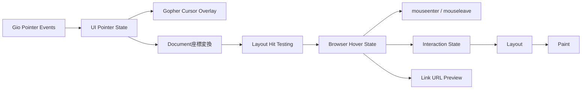

# Growse v0.3.0 スコープ定義書

## 1. 文書概要

### 1.1 対象バージョン

```text
Growse v0.3.0
```

### 1.2 本書の目的

本書は、Growse v0.3.0で実装する機能、完了条件、および対象外とする機能を定義する。

v0.3.0では、これまでに成立した次の実行モデルを維持する。

```text
HTML = Structure
CSS  = Presentation
Go   = Behavior
```

JavaScriptエンジン、WebAssembly、WebView、および既存ブラウザエンジンは使用しない。

---

## 2. リリーステーマ

v0.3.0のテーマを以下とする。

> **Gopherと一緒に、操作できる場所が直感的に分かるブラウザへ。**

v0.2.0では、動的DOM、テキスト入力、フォーム、およびイベントを追加し、WebGoだけでTodoアプリケーションを構築できるようになった。

v0.3.0では、クリックした瞬間だけではなく、ポインターがどこにあり、何を操作しようとしているかを継続的に扱う。Growse固有のGopherカーソル、CSSの`:hover`、WebGoのhoverイベント、およびリンク先プレビューを同じポインター状態から提供する。

このリリースには、[Issue #5「マウスカーソルがgopher君」](https://github.com/Growse-Project/Growse/issues/5)を含める。

---

## 3. 目標

v0.3.0では、以下を達成する。

1. Growseウィンドウ内のマウスカーソルを青いGopherとして描画する
2. ポインター位置から、現在hover中のDOM要素と祖先要素を特定する
3. CSSの`:hover`疑似クラスを解釈し、表示へ反映する
4. `mouseenter`と`mouseleave`イベントをWebGoへ配信する
5. リンクへhoverしたときに遷移先URLを確認できる
6. スクロールや動的DOM変更後もポインター状態を正しく保つ
7. カーソル描画がクリック、入力、スクロールを妨げない
8. Linux、macOS、Windowsで同じ操作モデルを提供する

---

## 4. Gopher Cursor

### 4.1 使用アセット

Gopherカーソルの唯一の原本として、次のSVGを使用する。

```text
internal/ui/assets/blue.svg
```

別のGopher画像への置き換え、ネットワークからの画像取得、およびページ側からのカーソル画像指定は行わない。

SVGはGrowseのビルドへ埋め込み、起動時に一度だけ描画可能な画像へ変換してキャッシュする。フレームごとのSVG解析は行わない。

配布バイナリ単体でカーソルを表示できるようにし、実行時に外部アセットファイルを要求しない。

### 4.2 表示範囲

Gopherカーソルは、次を含むGrowseウィンドウのクライアント領域全体で表示する。

- 戻る、進む、再読込ボタン
- URL入力欄
- Gopherボタン
- ページViewport
- スクロール中のViewport

ポインターがウィンドウ外へ出た場合はGopherカーソルを描画しない。OS上のほかのアプリケーションのカーソルは変更しない。

### 4.3 サイズとホットスポット

基準サイズを次のとおりとする。

```text
高さ: 32dp
幅: SVGのアスペクト比から算出
```

HiDPI環境ではGioのMetricに従ってピクセルサイズを決定し、見かけ上の大きさを維持する。

クリック位置を表すホットスポットは画像左上から`2dp, 2dp`とする。カーソル画像の描画位置は、実際のポインター座標からホットスポットを差し引いて決定する。

サイズとホットスポットはマジックナンバーにせず、UIパッケージ内の名前付き定数として管理する。

### 4.4 ネイティブカーソルとの関係

Gopherカーソルを描画できる間は、Growseウィンドウ内のネイティブカーソルを非表示にする。Gopherとネイティブカーソルを同時に表示しない。

次の場合は安全側へフォールバックし、ネイティブカーソルを利用できる状態を維持する。

- SVGの初期化に失敗した
- ウィンドウがポインター座標を取得できない
- ウィンドウがフォーカスを失った
- アプリケーションが終了処理中である

カーソル初期化の失敗だけでGrowseプロセスを終了させない。エラーをログへ記録し、ページ閲覧を継続する。

### 4.5 描画順序

Gopherカーソルは、ToolbarとViewportの描画後に最前面へ描画する。

```text
Browser Chrome / Page Viewport
  -> Input and Focus Decorations
  -> Gopher Cursor Overlay
```

カーソルOverlayは表示専用とし、クリック、スクロール、キーボードフォーカス、およびDOMのHit Testingを消費しない。

### 4.6 アクセシビリティ

OSの拡大率を尊重し、カーソルサイズを物理ピクセル固定にしない。

v0.3.0ではカーソル設定画面を追加しない。ただし、初期化失敗時に通常カーソルへ戻れる設計とし、将来の「Gopherカーソルを無効化する設定」を追加できる責務分離を行う。

---

## 5. Pointer State

### 5.1 状態モデル

UIは最後に受け取ったポインター情報として、少なくとも次を保持する。

```go
type PointerState struct {
    Position image.Point
    Inside   bool
}
```

DOMに関係するhover状態は、UI座標そのものではなくNode IDの経路としてBrowser側へ渡す。

```go
type HoverState struct {
    Target dom.NodeID
    Path   []dom.NodeID
}
```

`Path`はDocument側から対象要素までの接続済み要素を外側から内側の順に保持する。

### 5.2 更新契機

hover状態は次の場合に再評価する。

- ポインターが移動した
- ポインターがウィンドウへ入った、またはウィンドウから出た
- Viewportをスクロールした
- DOM Mutationが発生した
- Computed StyleまたはLayout Treeが再生成された
- ページ遷移、再読込、戻る、進むが完了した

同じhover経路が維持されている場合、不要なStyle再計算、イベント配信、および再描画を行わない。

### 5.3 Hit Testing

ポインターのウィンドウ座標を、Toolbarを除外したDocument座標へ変換してから、Layout Treeに対してHit Testingを行う。

スクロール位置、Gioのピクセル密度、およびDisplay Listの先頭オフセットを考慮する。

次の要素はhover対象にしない。

- `display: none`の要素
- Layout Boxを持たない要素
- Documentから削除された要素
- 現在のViewport外にあり、ポインターと交差しない要素

同じ位置で複数のBoxが重なる場合は、実際の描画順で最前面の要素を対象とする。

### 5.4 ページ境界

Toolbar上のポインター位置はGopherカーソルの描画には利用するが、DOMのhover対象にはしない。

ページ遷移時は以前のページのhover状態を破棄する。新しいページでは、最新のポインター位置と新しいLayout Treeから状態を再評価する。

---

## 6. CSS `:hover`

### 6.1 対応セレクター

v0.3.0では、既存の単純セレクターに`:hover`を1つ付けた形式を扱う。

```css
button:hover { background-color: #99f6e4; }
#save:hover { color: #115e59; }
.todo:hover { background-color: #f0fdfa; }
li.todo:hover { color: #134e4a; }
```

対応する形式は以下とする。

- `tag:hover`
- `#id:hover`
- `.class:hover`
- `tag.class:hover`

`:hover`単体、子孫結合子、子結合子、複数の疑似クラス、および`:not()`などの関数形式は対象外とする。

無効または未対応のセレクターは、そのルールだけを無視し、ページとRuntimeを停止させない。

### 6.2 hover対象

ポインター直下の最深要素と、その接続済み祖先要素をhover状態とする。

たとえば、`button`内の`span`上にポインターがある場合は、`span`と`button`の双方が`:hover`へ一致できる。

### 6.3 詳細度とCascade

`:hover`はクラスセレクターと同じ詳細度として計算する。

例として、`button:hover`の詳細度はタグ1、クラス相当1とする。既存どおり、詳細度、`!important`、ソース順の順にCascadeを決定する。

### 6.4 Style再計算

hover経路が変化した場合、最新のInteraction Stateを使ってComputed Styleを再計算する。

```text
Pointer Move
  -> Hit Testing
  -> Hover Path Diff
  -> Selector Matching
  -> Computed Style
  -> Layout Tree
  -> Display List
  -> Gio Renderer
```

hoverによってfont-size、padding、margin、displayなどが変わる可能性を許容する。その結果Hit Testingの対象が変わった場合でも、1フレーム内で無限に再計算しない。次のフレームで最新Layoutを使って再評価する。

DOMへhover用の`class`属性を追加する方式は採用しない。hoverは一時的なInteraction Stateとして保持し、WebGoから`GetAttribute("class")`を呼び出した結果へ混入させない。

---

## 7. WebGo Hover Event

### 7.1 イベント種類

v0.3.0では次のイベントを追加する。

| イベント | 発生条件 |
| --- | --- |
| `mouseenter` | ポインターが要素のhover経路へ新しく入った |
| `mouseleave` | ポインターが要素のhover経路から外れた |

既存の`dom.Event`を利用し、イベント種類、対象ID、およびDocument座標を渡す。

```go
element.OnMouseEnter(func(event dom.Event) {})
element.OnMouseLeave(func(event dom.Event) {})
```

### 7.2 配信順序

古いhover経路と新しいhover経路の共通祖先を比較し、次の順序で配信する。

1. 古い経路だけに存在する要素へ、内側から外側の順で`mouseleave`
2. 新しい経路だけに存在する要素へ、外側から内側の順で`mouseenter`

同じ要素内を移動し、hover経路が変わらない場合はイベントを再配信しない。

Event BubblingとEvent Captureは行わない。各イベントは、その経路へ出入りした要素自身に登録されたハンドラーだけへ配信する。

### 7.3 動的DOM

hover中の要素がWebGoによって削除された場合は、削除直前の有効な経路に対する`mouseleave`を可能な範囲で配信し、その後hover状態とイベントリスナーを破棄する。

イベントハンドラー内でDOMが変更された場合も、同じポインターイベントを再帰的に配信しない。Mutation後のhover再評価は次のUI更新単位で行う。

イベントハンドラーのpanicはv0.2.0と同じDispatcher境界で回収し、ほかのイベントとGrowseプロセスを継続する。

### 7.4 非対象イベント

イベント発生頻度とRuntime負荷を制御するため、v0.3.0では汎用の`mousemove`または`pointermove`をWebGoへ公開しない。

`mouseover`、`mouseout`、drag、drop、およびタッチイベントも対象外とする。

---

## 8. リンク先プレビュー

### 8.1 表示内容

ポインターが`href`を持つ接続済みの`a`要素またはその子孫へ乗った場合、現在ページのURLを基準に解決した絶対URLをBrowser UIへ表示する。

```text
https://example.com/docs/next
```

相対URLは解決後のURLを表示する。未対応スキームや無効なURLは表示しない。

### 8.2 表示位置

既存Toolbarの状態表示領域を利用し、追加ウィンドウやOS Tooltipは使用しない。

状態メッセージの優先順位は次のとおりとする。

1. ページロードエラーまたはRuntime Error
2. ナビゲーション中の状態
3. hover中のリンク先URL
4. 通常のページ状態

リンクから外れた場合は、通常のページ状態へ戻す。

### 8.3 セキュリティ

認証情報を含むURLを表示するときは、既存のURLログ方針と同様に秘匿情報を露出しない形式へ変換する。

リンク先プレビューは表示だけを行い、hoverによる先読み、DNS問い合わせ、HTTPリクエスト、およびWebGo実行は行わない。

---

## 9. 内部設計方針

### 9.1 責務分離

ポインター処理の責務を次のように分離する。



- SVGの読み込み、カーソル画像のキャッシュ、およびOverlay描画は`internal/ui`が担当する
- DOM要素のhover経路とイベント差分は`internal/browser`が管理する
- Node IDとBoxの対応およびHit Testingは`internal/layout`が担当する
- `:hover`の構文解析は`internal/css`が担当する
- Interaction Stateを使ったCascadeは`internal/style`が担当する
- DOMはhover状態やGio型を保持しない
- Paint EngineはブラウザUIのGopherカーソルをDisplay Listへ含めない

### 9.2 再描画

ポインターが移動した場合、Gopherカーソル自体は新しい位置へ描画するためUIをInvalidateする。

ただし、DOMのhover経路が変化しなければComputed Style、Layout Tree、およびDisplay Listを再生成しない。カーソル移動だけの更新とページ再計算を区別する。

### 9.3 ライフサイクル

次の場合はhover状態を確実に解除する。

- ポインターがウィンドウから出た
- ウィンドウがフォーカスを失った
- ページ遷移または再読込が始まった
- BrowserまたはUIがCloseされた
- hover対象の要素が削除された

古いページのNode IDやイベントリスナーを新しいページへ持ち越さない。

---

## 10. セキュリティと信頼境界

`internal/ui/assets/blue.svg`はGrowse自身に同梱する信頼済み静的アセットとして扱う。

この実装を一般的なSVGレンダラーとして公開しない。Webページ内のSVG、外部OriginのSVG、CSSの`cursor: url(...)`、およびWebGoが指定したSVGはv0.3.0では読み込まない。

SVGの初期化エラー、hoverイベントハンドラーのpanic、および無効な`:hover`ルールによってGrowseプロセス全体を終了しない。

WebGoの実行OriginとSandboxに関する制約は、v0.2.0および`SECURITY.md`の方針を維持する。

---

## 11. 対応OS

v0.3.0の配布対象を以下とする。

- Linux amd64
- macOS Intel
- macOS Apple Silicon
- Windows amd64
- Docker Linux amd64

Gopherカーソルの位置、サイズ、ホットスポット、およびクリック対象がOS固有のピクセル密度によって変化しないことを目標とする。

DockerイメージではGUI表示にホストのディスプレイサーバーが必要であるという既存条件を維持する。

---

## 12. テスト方針

### 12.1 Unit Test

少なくとも以下をテストする。

- `blue.svg`を埋め込み、カーソル画像として初期化できる
- SVGのアスペクト比を保って基準サイズへ変換できる
- ポインター座標とホットスポットから描画位置を算出できる
- ウィンドウへのEnter、Move、LeaveでPointer Stateが更新される
- Toolbar座標をDOMのHit Testingへ渡さない
- スクロール位置を含むDocument座標変換
- 最前面のLayout BoxをHit Testingで選択する
- hover経路の差分とイベント配信順序
- 対応する`:hover`セレクターの解析、詳細度、および不一致
- hover状態を含むStyle Cascade
- 同一hover経路ではStyle再計算を要求しない
- 無効なURLをリンク先プレビューへ表示しない

### 12.2 Integration Test

Browser、UI、DOM、CSS、Style、Layout、Paint、およびEventを結合し、以下をテストする。

- 実際のGioポインター移動でGopherカーソルが移動する
- カーソルOverlayがクリックを妨げない
- リンクまたはボタンへのhoverで`:hover`スタイルが描画へ反映される
- 要素から外れたときに通常スタイルへ戻る
- WebGoへ`mouseenter`と`mouseleave`が規定順で配信される
- hoverハンドラーによるDOM変更が次の描画へ反映される
- hover中の動的要素を削除してもpanicしない
- スクロール後も画面上の要素とhover対象が一致する
- リンクへhoverすると解決済みURLが表示される

### 12.3 Regression Test

次を維持する。

- Counter Demo
- Todo Demoの入力、追加、完了、削除
- URL入力欄とページ内inputのフォーカス
- click、input、change、submitイベント
- Navigation、History、およびReload
- 動的DOM変更後のStyle、Layout、およびPaint
- Yaegi Runtimeのエラー分離

---

## 13. 実装フェーズ

### Phase 1 — Gopher Cursor

- `blue.svg`の埋め込みと初期化
- Pointer Stateの導入
- ネイティブカーソルの非表示とフォールバック
- HiDPI対応のCursor Overlay
- クリックとスクロールの透過

### Phase 2 — Hover State

- Move、Enter、Leaveの取得
- スクロール対応のDocument座標変換
- Layout Hit Testingとhover経路
- Mutation、Navigation、Close時の状態破棄

### Phase 3 — CSSとWebGo Event

- `:hover`セレクターと詳細度
- Interaction Stateを使ったStyle再計算
- `OnMouseEnter`と`OnMouseLeave`
- 経路差分によるイベント配信
- handler panicと動的DOMの回帰確認

### Phase 4 — Browser UX

- リンク先URLの解決と表示
- エラー、ロード中、リンクhoverの表示優先順位
- Counter DemoとTodo Demoへのhoverスタイル追加
- README更新

### Phase 5 — リリース安定化

- Linux、macOS、Windowsのカーソル動作確認
- raceテストとカバレッジ確認
- Staticcheck、actionlint、govulncheck
- Dockerイメージ確認
- v0.3.0インストーラー確認
- v0.3.0リリースノート作成

---

## 14. v0.3.0 非対象

以下はv0.3.0の対象外とする。

- CSSの`cursor`プロパティ
- WebページまたはWebGoによるカーソル画像の変更
- 外部SVGおよびHTML内のSVG描画
- アニメーションカーソル
- OS全体のカーソル変更
- カーソルテーマ、サイズ、ホットスポットの設定画面
- `mousemove` / `pointermove`のWebGo API
- `mouseover` / `mouseout`
- Event Bubbling / Event Capture
- drag / drop
- タッチ、スタイラス、およびマルチポインター
- `:active` / `:focus` / `:focus-visible`など`:hover`以外の疑似クラス
- 複雑なCSS結合子と`:not()`などの関数疑似クラス
- hoverによるネットワーク先読み
- JavaScript / TypeScript
- WebAssemblyによるGo実行
- 任意のインターネットサイト向けSandbox
- Flexbox / CSS Grid
- CSS Animation / Transition
- 複数タブ
- DevTools

---

## 15. 完了条件

以下をすべて満たした場合、Growse v0.3.0を完成とする。

### Gopher Cursor

- [x] [Issue #5](https://github.com/Growse-Project/Growse/issues/5)を実装し、マウスカーソルが青いGopherになる
- [x] カーソル画像に`internal/ui/assets/blue.svg`を使用する
- [x] SVGをビルドへ埋め込み、実行時に外部ファイルを要求しない
- [x] Gopherカーソルを32dp基準かつ正しいアスペクト比で表示できる
- [x] HiDPI環境でもカーソルの見かけ上のサイズとホットスポットが維持される
- [x] ToolbarとViewportの双方でGopherカーソルを表示できる
- [x] Gopher表示中はネイティブカーソルと二重表示にならない
- [x] ウィンドウ外または初期化失敗時に安全なカーソル状態へ戻れる
- [x] Cursor Overlayがクリック、inputフォーカス、およびスクロールを妨げない

### Hover

- [ ] ポインター移動から最前面のDOM要素を特定できる
- [ ] スクロール後も正しいDocument座標でHit Testingできる
- [ ] hover中の要素と祖先要素を経路として保持できる
- [ ] `tag:hover`を解釈できる
- [ ] `#id:hover`を解釈できる
- [ ] `.class:hover`を解釈できる
- [ ] `tag.class:hover`を解釈できる
- [ ] `:hover`の詳細度とCascadeを正しく計算できる
- [ ] hover開始時にComputed Style、Layout、Display Listを更新できる
- [ ] hover終了時に通常の表示へ戻せる
- [ ] 同じhover経路内の移動では不要なページ再計算を行わない
- [ ] hover用の一時状態がDOMのclass属性へ混入しない

### WebGo EventとBrowser UX

- [ ] WebGoへ`mouseenter`イベントを配信できる
- [ ] WebGoへ`mouseleave`イベントを配信できる
- [ ] 祖先を含むhover経路の差分に従ってイベントを規定順で配信できる
- [ ] hover handlerのpanicでGrowseが終了しない
- [ ] hover中の動的要素を削除しても古いイベントを呼び出さない
- [ ] リンクへのhover中に解決済み遷移先URLを表示できる
- [ ] リンクから外れたら通常の状態表示へ戻せる
- [ ] hoverだけでHTTPリクエストを発生させない

### 品質とリリース

- [ ] Counter Demoが引き続き動作する
- [ ] Todo Demoの入力、追加、完了、削除が引き続き動作する
- [ ] Counter DemoとTodo Demoで`:hover`の視覚変化を確認できる
- [ ] `go test ./...`が成功する
- [ ] `make ci`が成功する
- [ ] CIの全必須チェックが成功する
- [ ] Linux、macOS、WindowsでGopherカーソルを確認できる
- [ ] Linux、macOS、Windows向け成果物を生成できる
- [ ] Dockerイメージを生成できる
- [ ] インストーラーでv0.3.0を導入できる
- [ ] READMEとSECURITY.mdがv0.3.0の仕様と一致する

Issue #5は、Gopher Cursor節の完了条件をすべて満たし、対象OSでの表示と入力非干渉を確認した時点で完了とする。

---

## 16. Growse v0.3.0の定義

Growse v0.3.0を以下のように定義する。

> **青いGopherカーソルと一貫したhover状態を備え、CSSとGoの双方からポインター操作へ反応できる、操作の手応えを持ったネイティブWebブラウザ。**
